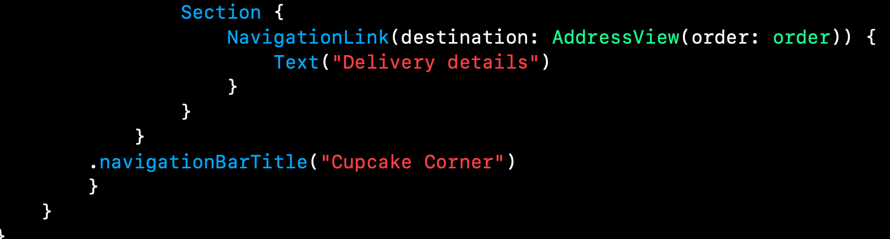
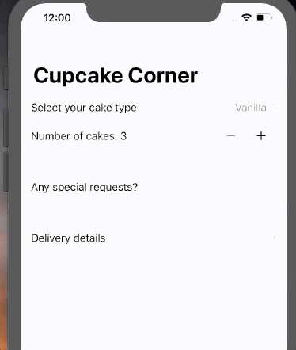

# Cupcake

Zig Zaglar once said: 

> There are two sure ways to fail: think and never do, or do and never think. 

## Adding Codable conformace for @Published properties

If all the properties of a type conform to **Codable** then that type automatically conforms to **Codable**, however, that is not the case when we use the property wrapper **@Published**. This happens because *property wrapper* means that our property is wrapped inside another type that adds some additional functionality, in this case, a struct called **Published** which is a generic type, which means we cannot create an instance of **Published** all by itself, but rather make an instance of **Published<String>**. Therefore, we need to create the conformance to **Codable** ourselves by indicating which properties should be *encoded* and *decoded*. 


1. This initializer is handed an instance of **Decoder** which contains all our data but it's down to us to figure out how to read it. 
2. Anyone who subclasses **User** must override this initializer with a custom implementation to make sure they add their own values. We mark this using the **required** keyword. An alternative would be to mark this class as **final** so that subclassing isn't allowed and drop the **required**. 
3. Inside the method we ask our **Decoder** instance for a container matching all the coding keyrs we already set in our **CodingKey** struct. 
4. Finally, we can read values directly from that container by referencing cases in our enum which provides really strong safety in two ways: 
   1. We're making clear we expect to read strings, so if **name** changes to an integer, the code will stop compiling. 
   2. We're using a case in our **CodingKeys** enum so there's no chance of typos. 

## Sending and receiving Codable data with URLSession and SwiftUI

Steps needed to complete a request: 

1. Creating the URL we want to read from.
2. Wrapping that in a **URLRequest** which allows us to configure how the URL should be accessed. 
3. Create and start a networking task from that URL request. 
4. Handle the result of that networking task. 

**URLSession** is the iOS class responsible for managing network requests. 

- **data**: whatever data was returned from the request.
- **response**: description of the data which might include what type of data it is, howm uch was sent, whether there was a status code, etc.
- **error**: error that ocurred.

**URLSession** runs in the *background thread* which means the network request can be running, and even take a few seconds, without stopping our UI from being interactive. 


## Validating and disabling forms


---

## Taking basic order details






## Checking for a valid address

One of the reasons we use a **class** for our data is the fact that whenever we change between different views, the data will not be erased. Whereas using a **struct** the data will be erased. 


## Preparing for checkout 


---

## Encoding an ObservableObject class

```swift
class Order: ObservableObject, Codable {
    static let types = ["Vanilla", "Strawberry", "Chocolate", "Rainbow"]
    @Published var type = 0
    @Published var quantity = 3
    @Published var specialRequestEnabled = false {
        didSet {
            if specialRequestEnabled == false {
                extraFrosting = false
                addSprinkles = false
            }
        }
    }
    @Published var extraFrosting = false
    @Published var addSprinkles = false
    @Published var name = ""
    @Published var streetAdress = ""
    @Published var city = ""
    @Published var zip = ""
    var hasValidAddress: Bool {
        if name.isEmpty || streetAdress.isEmpty || city.isEmpty || zip.isEmpty {
            return false
        }
        return true
    }
    var cost: Double {
        var cost = Double(quantity) * 2
        cost += Double(type) / 2
        if extraFrosting {
            cost += Double(quantity)
        }
        if addSprinkles {
            cost += Double(quantity) / 2
        }
        return cost
    }
    
    enum CodingKeys: CodingKey {
        case type, quantity, extraFrosting, addSprinkles, name, streetAddress, city, zip
    }
    
    func encode(to encoder: Encoder) throws {
        var container = encoder.container(keyedBy: CodingKeys.self)
        try container.encode(type, forKey: .type)
        try container.encode(quantity, forKey: .quantity)
        try container.encode(extraFrosting, forKey: .extraFrosting)
        try container.encode(addSprinkles, forKey: .addSprinkles)
        try container.encode(name, forKey: .name)
        try container.encode(streetAdress, forKey: .streetAddress)
        try container.encode(city, forKey: .city)
        try container.encode(zip, forKey: .zip)
    }
    
    required init(from decoder: Decoder) throws {
        let container = try decoder.container(keyedBy: CodingKeys.self)
        type = try container.decode(Int.self, forKey: .type)
        quantity = try container.decode(Int.self, forKey: .quantity)
        extraFrosting = try container.decode(Bool.self, forKey: .extraFrosting)
        addSprinkles = try container.decode(Bool.self, forKey: .addSprinkles)
        name = try container.decode(String.self, forKey: .name)
        streetAdress = try container.decode(String.self, forKey: .streetAddress)
        city = try container.decode(String.self, forKey: .city)
        zip = try container.decode(String.self, forKey: .zip)
    }
    
    init() {}
}
```

## Sending and receiving orders over the internet

