# Bookworm

Canadian software developer Rob Pike once said

> ​	Data dominates. If you've chosen the right data structures and organized things well, the algorithms will almost always be self-evident.  Data structures, not algorithms, are central to programming. 

Objective: **CoreData** -> Apple's framework for working with databases. 

## Creating a custom component with @Binding

**@State**: lets us work with local value types.

**@ObservedObject**: lest us work with sharable reference types.

**@Binding**: lets us connect an **@State** property of one view to some underlying model data. It lets us create a mutable value in a view, that actually points to some other value from elsewhere. 

**@Binding** allows us to create a two-way connection between PushButton and whatever is using it. 

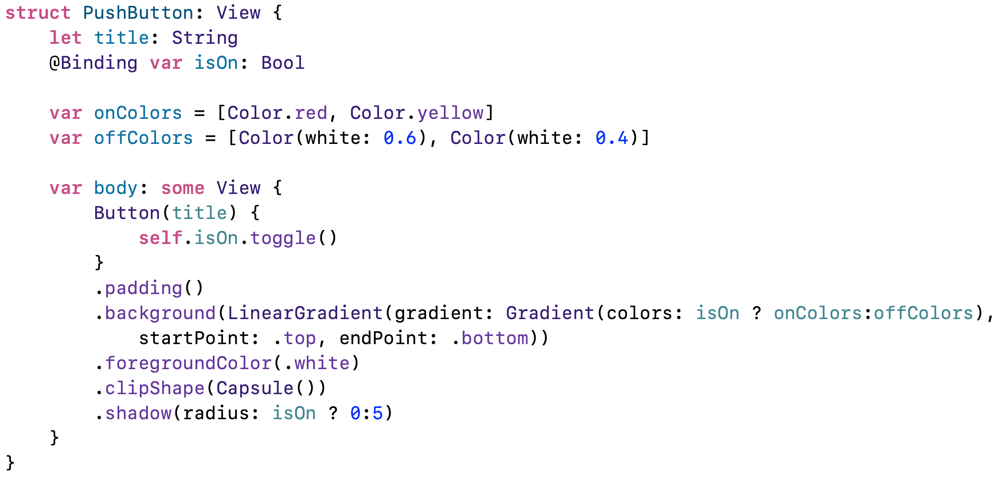

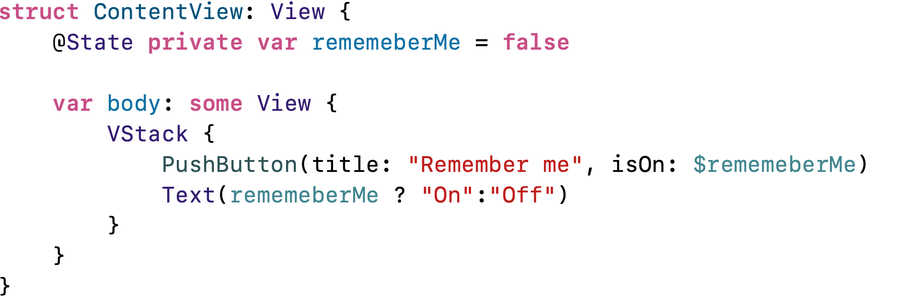


## Use size classes with AnyView type erasure

Size classes is a thoroughly vague way of telling us how much space we have for our views. We have only two size classes: 

- Compact
- Regular

**AnyView** is called a *type erased wrapper*. **AnyView** effectively hides - or erases - the type of the views it contains. 

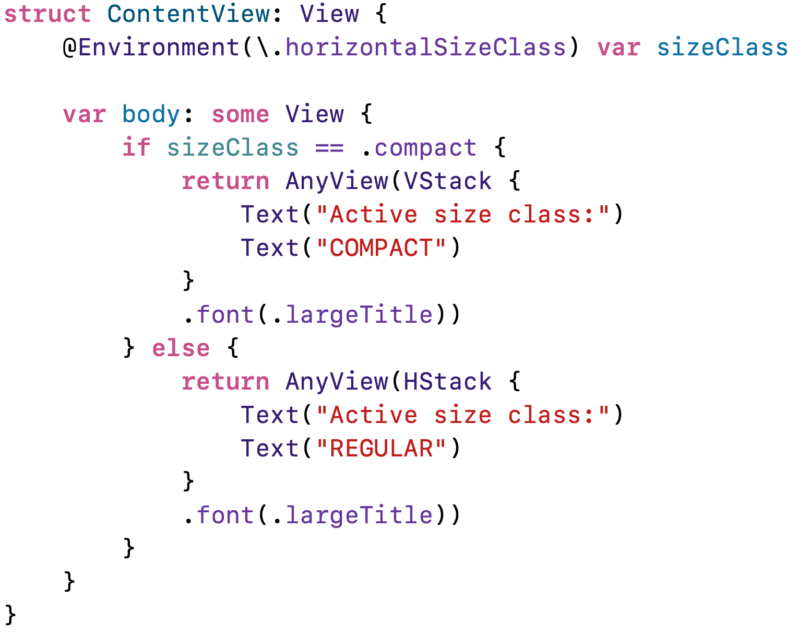

## How to combine Core Data and SwiftUI

Core Data is an object graph and persistence framework, i.e., it lets us define objects and properties of those objects, then lets us read and write them from permanent storage. Core Data is capable of sorting and filtering our data and work with much larger data. Core Data implements more advanced functionality such as: data validation, lazy loading of data, undo and redo, etc. 

Setting up Core Data requires two steps: creating what's called a persistent container, which is what loads and saves the actual data from device storage, and injecting that into the SwiftUI environment so that all our views can access it. These steps are already done by Xcode. The only thing left is for us to decide what data we want to store in Core Data and how to read if back out. We define our types as *entities*, then create properties in there as *attributes*. 

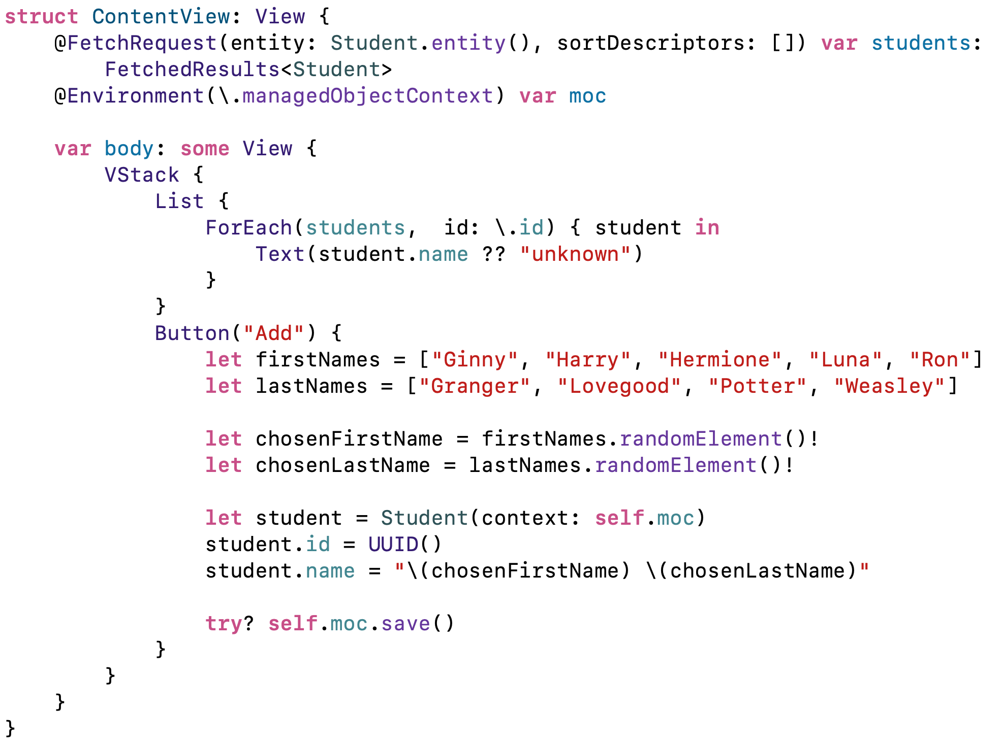

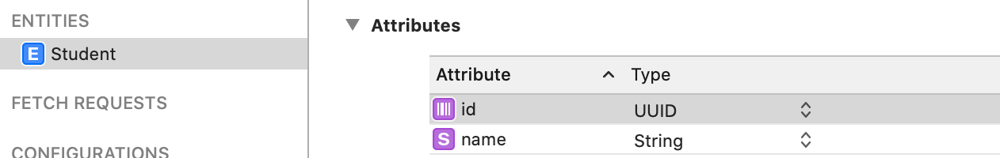

```moc``` is a property where a *managed object context* is stored. **Student** inherits from **NSManagedObject** which is a class and these objects are called *managed* because Core Data is looking after them: it loads them from the persistent container and writes their changed back too. All of out objects live inside a *managed object context* which is responsible for fetching managed objects, as well as saving changes and more.

---

## Creating books with Core Data

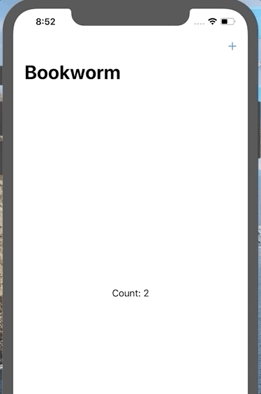

## Adding a custom star rating component

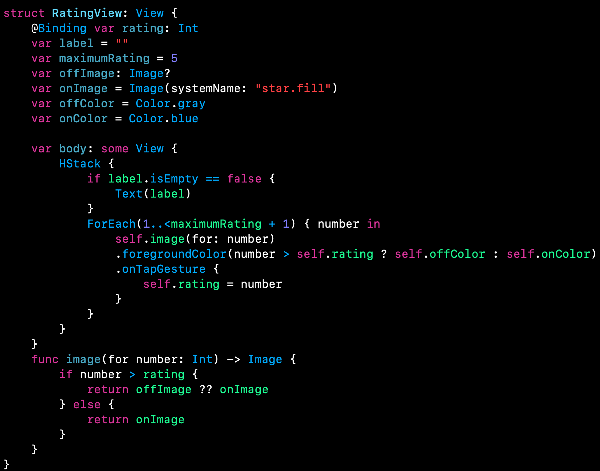

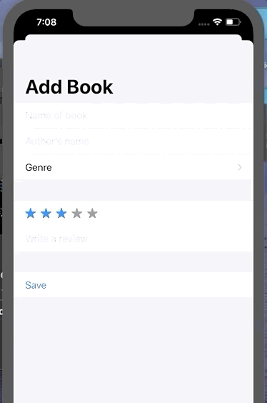

## Building a list with @FetchRequest

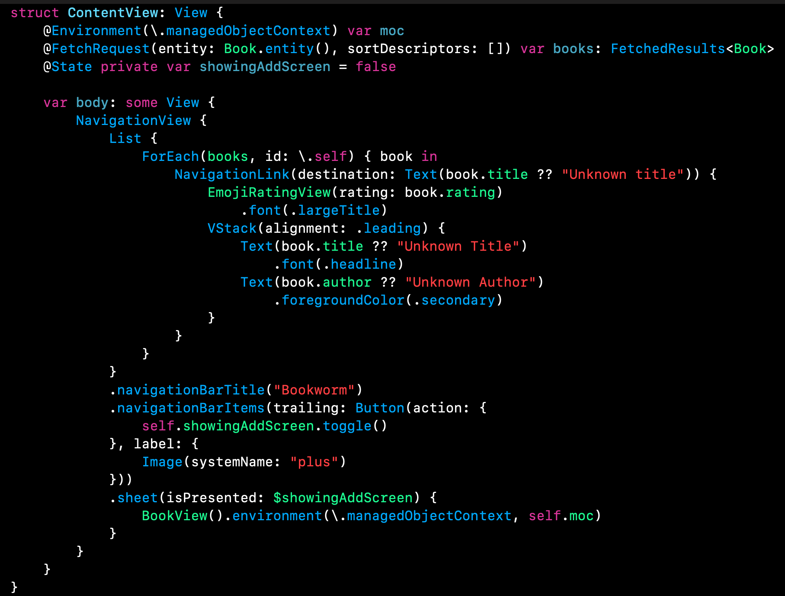

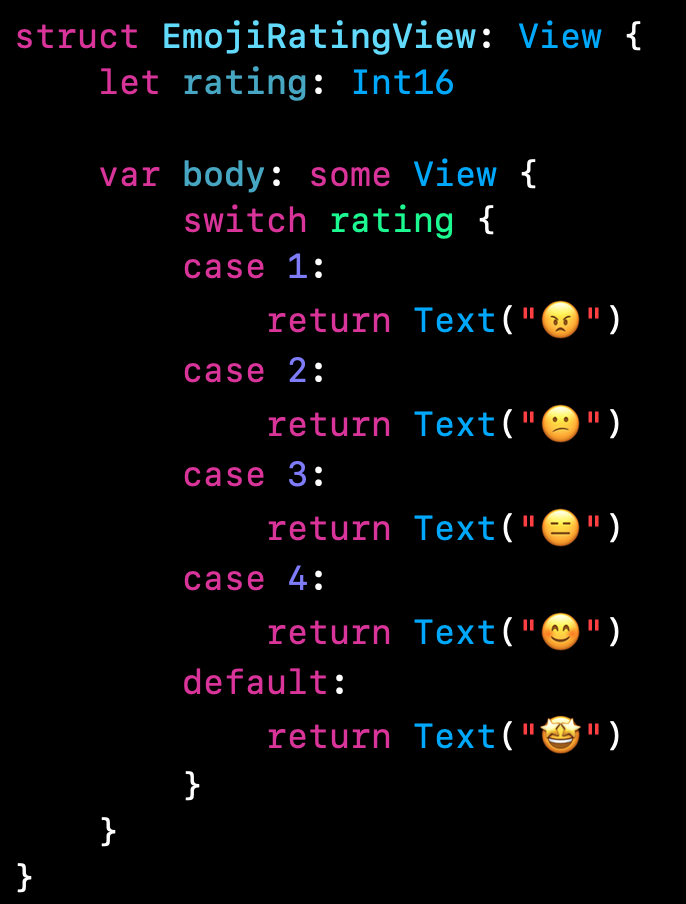

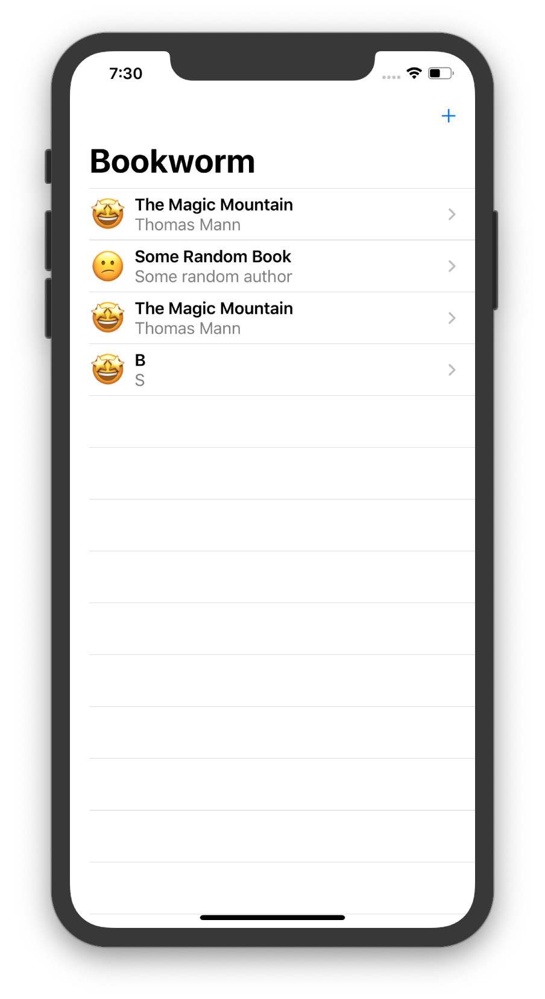

