# Core Data: third technique project

Jim Rohn once said...

> Success is neither magical nor mysterious - success is the natural consequence of consistently applying the basic fundamentals. 

## Why does \\.self work for ForEach?

We can use ```\.self``` when we aren't conforming to **Identifiable** and don't have a keypath that's unique. With Core Data we used `\.self` for the managed object class that Xcode generated for us. So what actually happens is that Swift computes the *hash value* of the struct, which is a way of representing complex data in fixed-size values, then uses that hash as an identifier. Hash values can be generated in any number of ways, but the concept is identical for all hash-generating functions: 

1. Regardless of the input size, the output should be the same fixed size.
2. Calculating the same hash for an object twice in a row should return the same value.

All this matters because when Xcode generates a class for our managed objects, it makes that class conform to `Hashable`, which is a protocol that means Swift can generate hash values for it, which in turn means we can use `\.self` for the identifier. This is also why `String` and `Int` work with `\.self`: they also conform to `Hashable`.

Core Data does something really smart here: the objects it creates for us actually have a selection of other properties beyond those we defined in our data model, including one called the object ID – an identifier that is unique to that object, regardless of what properties it contains. These IDs are similar to `UUID`, although Core Data generates them sequentially as we create objects.

> So, `\.self` works for anything that conforms to `Hashable`, because Swift will generate the hash value for the object and use that to uniquely identify it. This also works for Core Data’s objects because they already conform to `Hashable`.

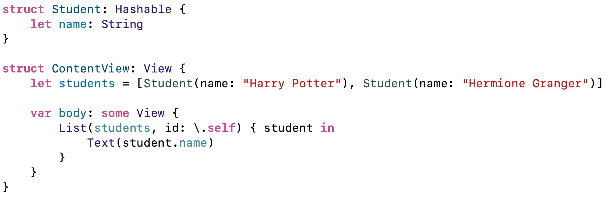

## Creating NSManagedObject subclasses

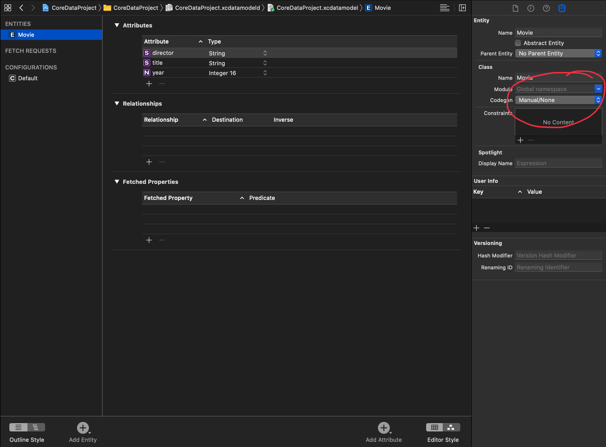

Then, to use it in code: **Editor > Create NSManagedObject subclass**. 

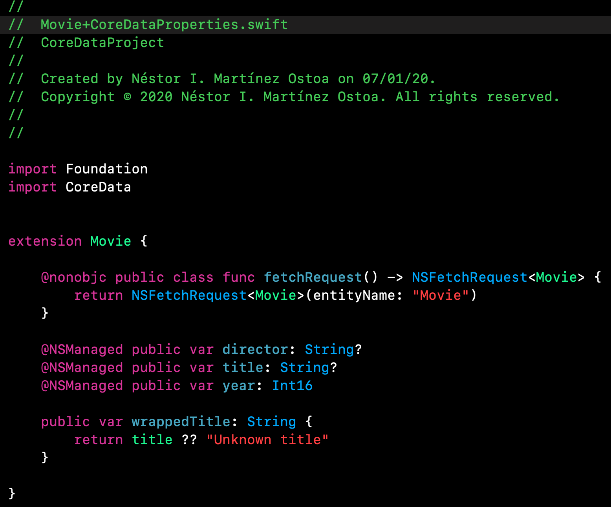

`@NSManaged` is *not* a property wrapper – this is much older than property wrappers in SwiftUI. Instead, this reveals a little of how Core Data works internally: rather than those values actually existing as properties in the class, they are really just there to read and write from a dictionary that Core Data uses to store its information. When we read or write the value of a property that is `@NSManaged`, Core Data catches that and handles it internally – it’s far from a simple Swift string.

Core Data is lazy, which means sometimes it looks like some data has been loaded when it really hasn’t been because Core Data is trying to minimize its memory impact. Core Data calls these *faults*, in the sense of a “fault line” – a line between where something exists and where something is just a placeholder. We don’t need to do any special work to handle these faults, because as soon as we try to read them Core Data transparently fetches the real data and sends it back – another benefit of `@NSManaged`. 

## Conditional saving NSManagedObjectContext

Apple specifically states that we should always check for uncommitted changes before calling `save()`, to avoid making Core Data do work that isn’t required.

```swift
if self.moc.hasChanges {
   try? self.moc.save()
}
```

## Ensuring Core Data objects are unique using constraints

Core Data gives us *constraints*: we can make one attribute constrained so that it must always be unique. We can then go ahead and make as many objects as we want, unique or otherwise, but as soon as we ask Core Data to save those objects it will resolve duplicates so that only one piece of data gets written. Even better, if there was some data already written that clashes with our constraint, we can choose how it should handle merging the data.

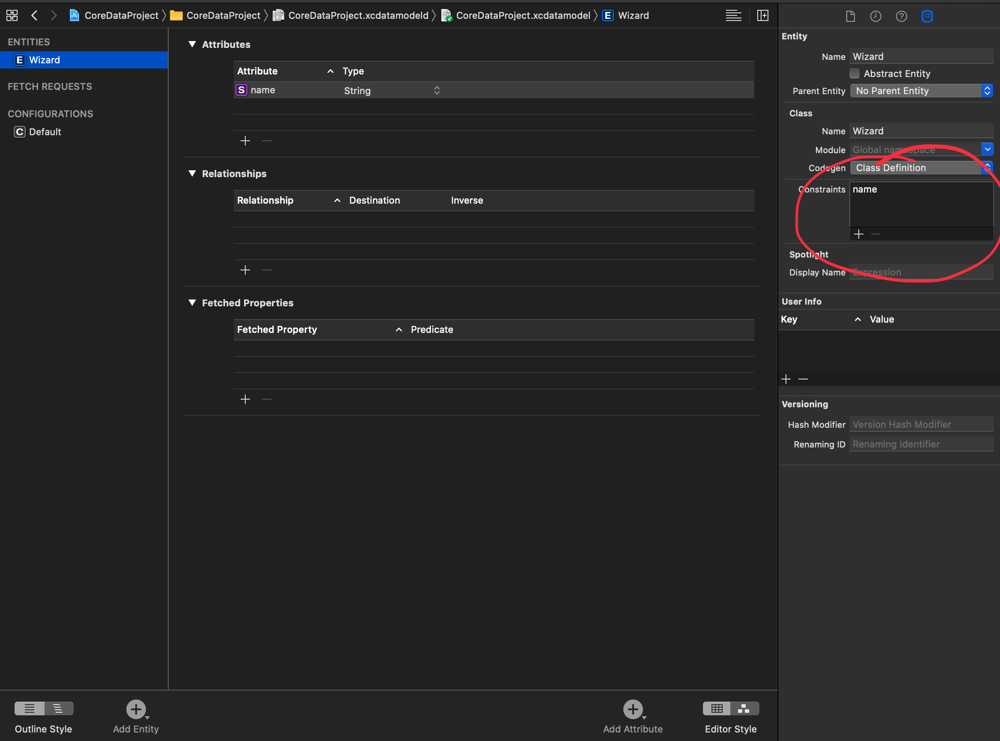

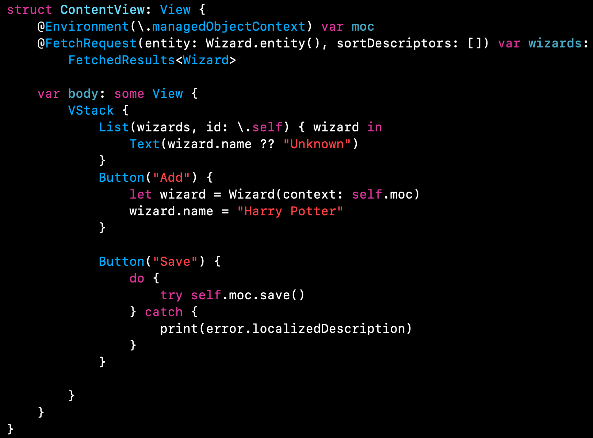

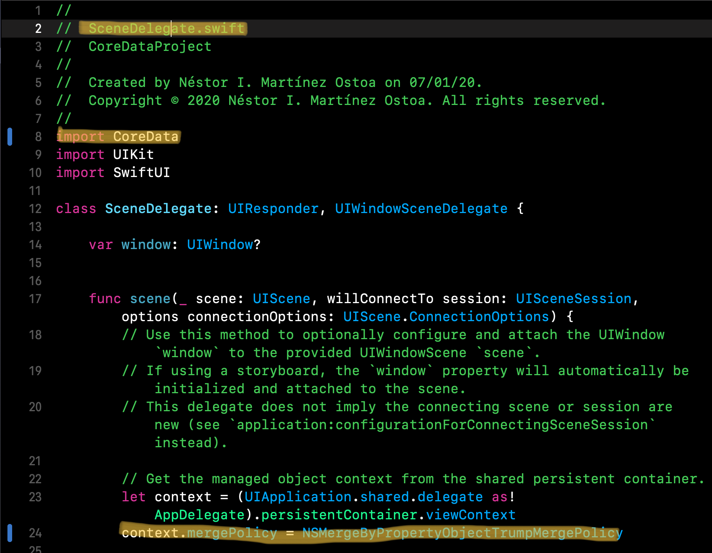

That asks Core Data to merge duplicate objects based on their properties – it tries to intelligently overwrite the version in its database using properties from the new version. 


---

## Filtering @FetchRequest using NSPredicate

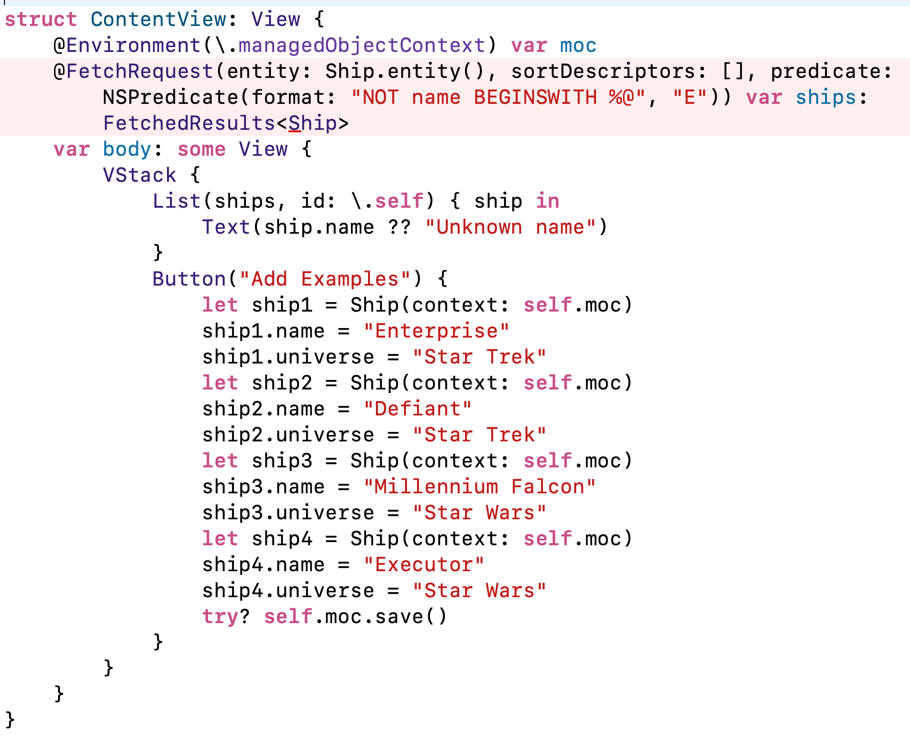

Other predicates: 

```swift
    NSPredicate(format: "universe == %@", "Star Wars"))
    NSPredicate(format: "name < %@", "F"))
    NSPredicate(format: "universe IN %@", ["Aliens", "Firefly", "Star Trek"])
    NSPredicate(format: "name BEGINSWITH %@", "E"))
    NSPredicate(format: "name BEGINSWITH[c] %@", "e"))
    NSPredicate(format: "NOT name BEGINSWITH[c] %@", "e"))
```

## Dynamically filtering @FetchRequest with SwiftUI

 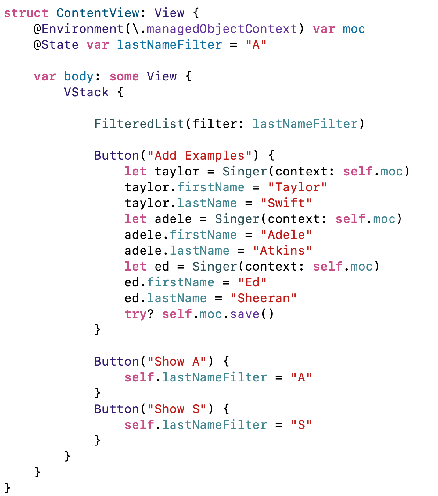

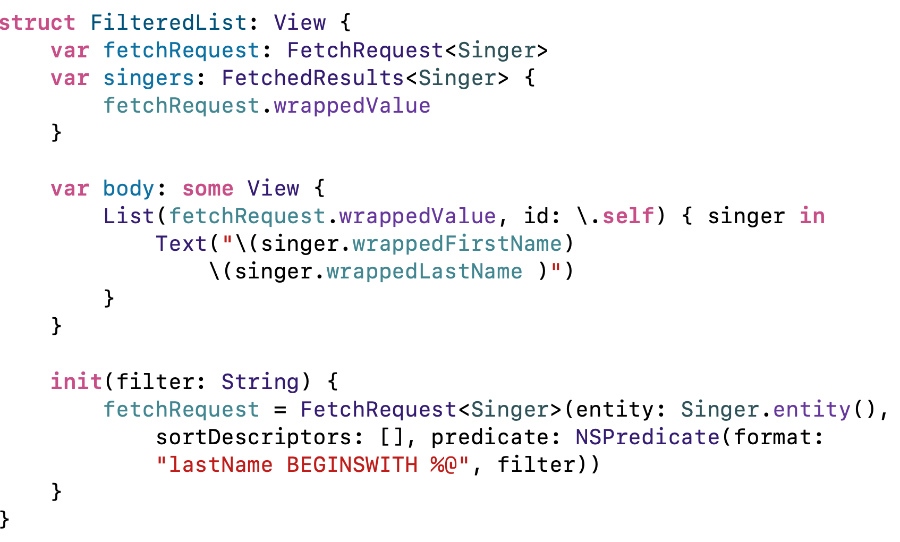

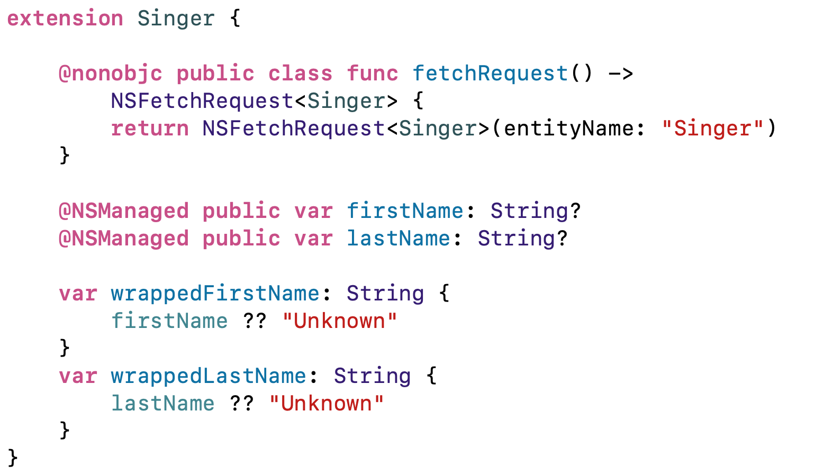

Now, adding more flexibility. We can improve our **FilteredList** to work with any kind of entity. 

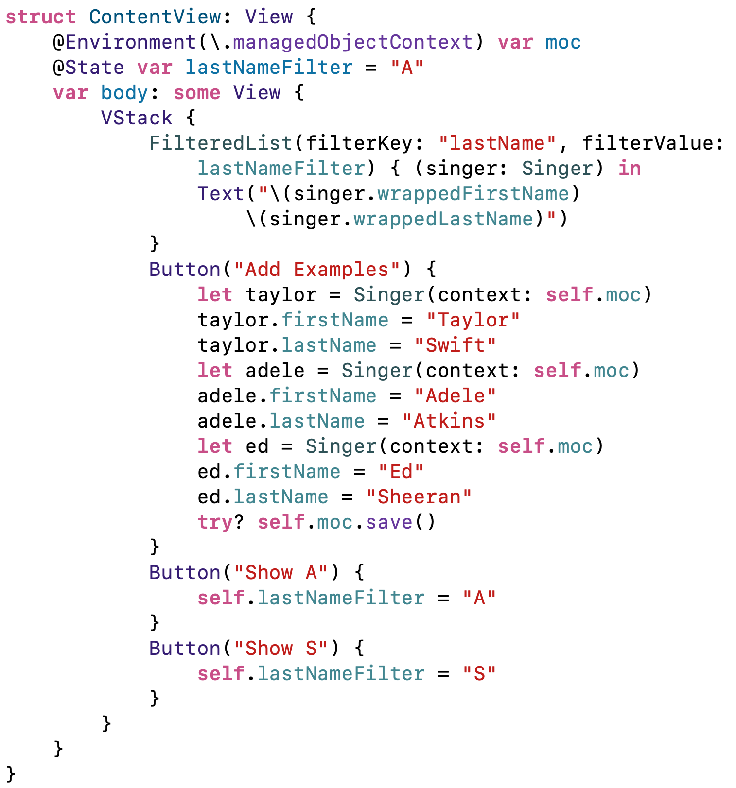

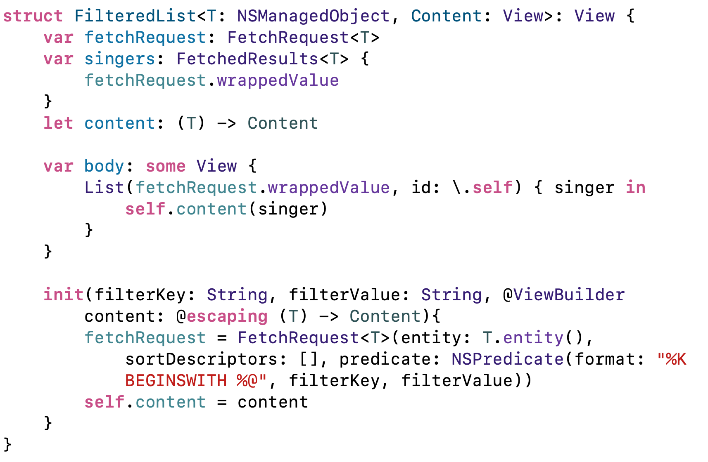


