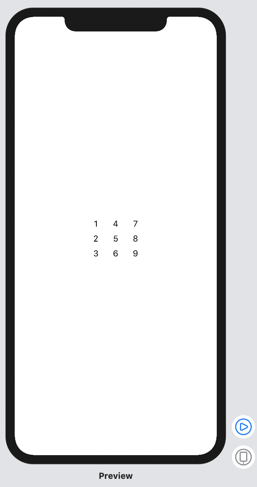
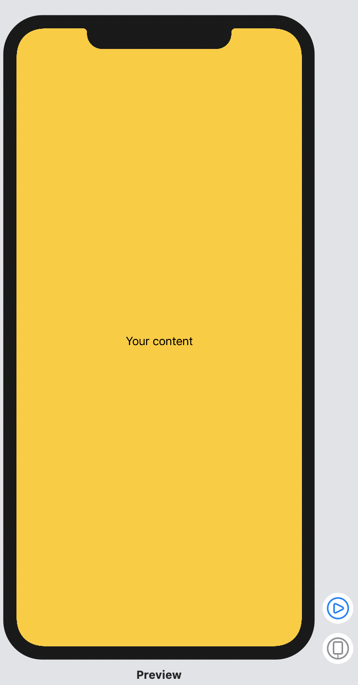
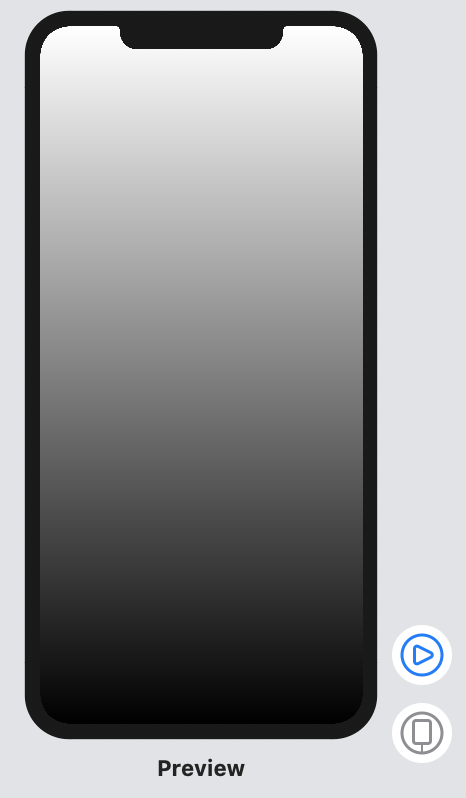
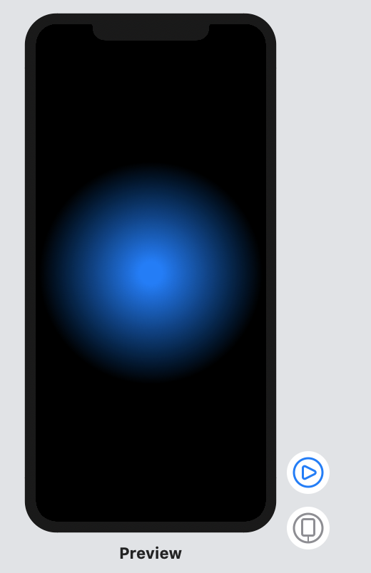
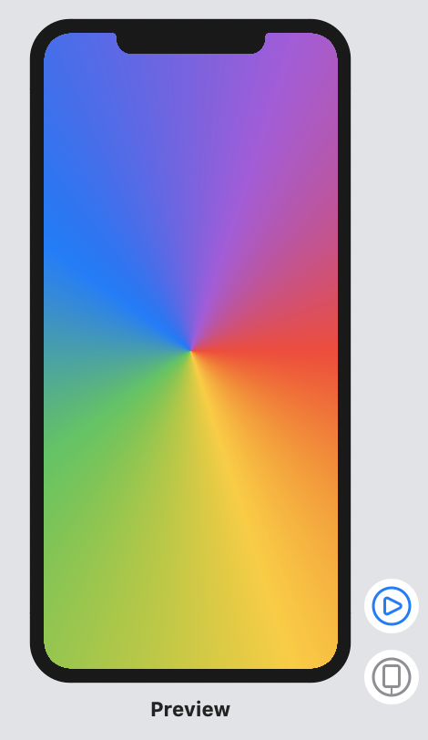
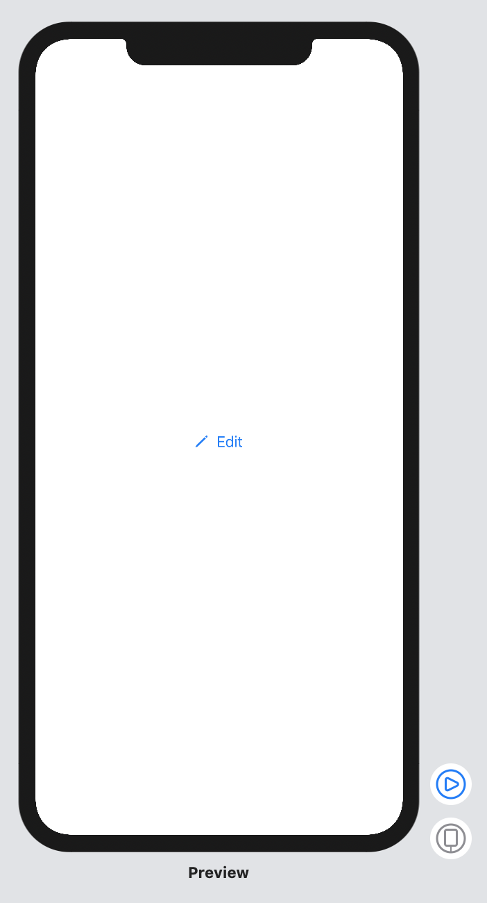
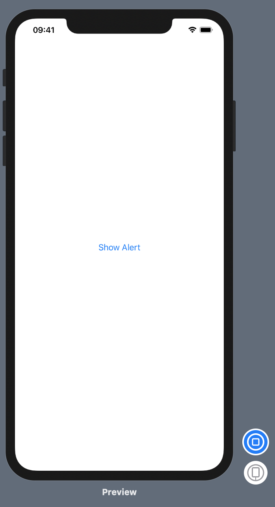
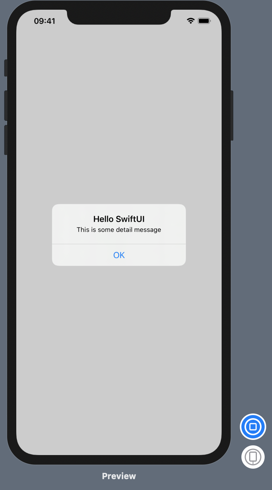

# Project Two: Guess the Flag

We need to get sure SwiftUI returns just one kind of view back. We cannot do the following: 

```swift
var body: some View {
    Text("First")
    Text("Second")
    Text("Third")
}
```

### Stacks

Therefore, we have the option to do **stacks**: 

- ```HStack```
- ```VStack``` 
- ```ZStack``` 

By default, and like any other view in SwiftUI, stacks can only have 10 children. If we want to use more, we should use a Group. 

```swift
struct ContentView: View {

    var body: some View {
        HStack (spacing: 30){
            VStack (spacing: 10){
                HStack {
                    Text("1")
                }
                HStack {
                    Text("2")
                }
                HStack {
                    Text("3")
                }
            }
            VStack (spacing: 10){
                HStack {
                    Text("4")
                }
                HStack {
                    Text("5")
                }
                HStack {
                    Text("6")
                }
            }
            VStack (spacing: 10) {
                HStack {
                    Text("7")
                }
                HStack {
                    Text("8")
                }
                HStack {
                    Text("9")
                }
            }
        }
    }
}
```



### Colors and frames 

```swift
struct ContentView: View {
    var body: some View {
        ZStack {
            Color(red: 1, green: 0.8, blue: 0).edgesIgnoringSafeArea(.all)
            Text("Your content")
        }
    }
}
```



### Gradients

```swift
struct ContentView: View {
    var body: some View {
        LinearGradient(gradient: Gradient(colors: [.white, .black]), startPoint: .top, endPoint: .bottom).edgesIgnoringSafeArea(.all)
    }
}
```



```swift
struct ContentView: View {
    var body: some View {
       RadialGradient(gradient: Gradient(colors: [.blue, .black]), center: .center, startRadius: 20, endRadius: 200).edgesIgnoringSafeArea(.all)
    }
}
```



```swift
struct ContentView: View {
    var body: some View {
        AngularGradient(gradient: Gradient(colors: [.red, .yellow, .green, .blue, .purple, .red]), center: .center).edgesIgnoringSafeArea(.all)
    }
}
```



### Buttons and images

```swift
struct ContentView: View {
    var body: some View {
        Button(action: {
            print("Button was tapped")
        }) {
            HStack (spacing: 10) {
                Image(systemName: "pencil")
                Text("Edit")
            }
        }
    }
}
```



### Showing alert messages 

```swift
@State private var showingAlert = false
    var body: some View {
        Button("Show Alert") {
            self.showingAlert = true
        }
        .alert(isPresented: $showingAlert) {
            Alert(title: Text("Hello SwiftUI"), message: Text("This is some detail message"), dismissButton: .default(Text("OK")))
        }
    }
```




