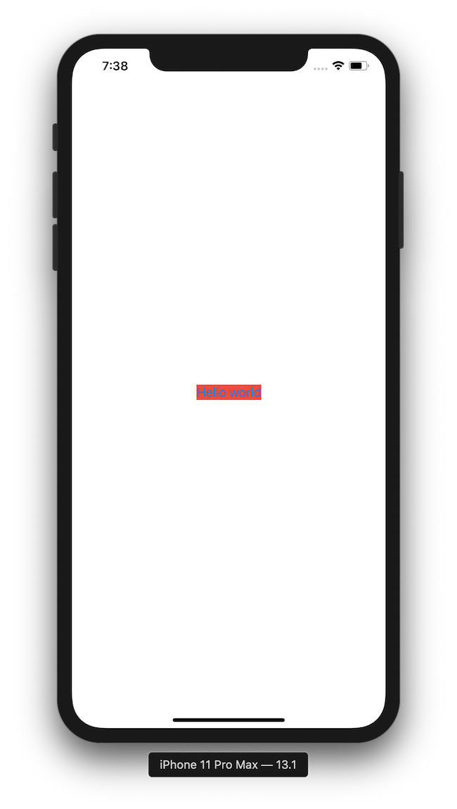
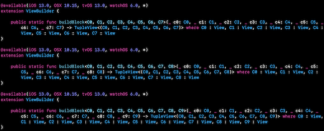
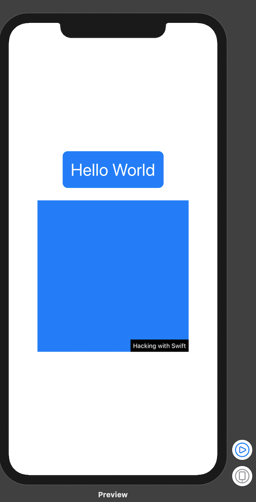

# First technique project

## Why does SwiftUI uses structs as views? 

1. **Performance**: structs are simpler  and faster than classes. In UIKit and AppKit, all the views you created inherited methods and attributes from UIView and the problem with this is that most of the time you wouldn't use most of them. Here in SwiftUI, all of the views are structs and are almost free to create. Structs contain only what you see and nothing more because inheritance is not allowed in structs. 
2. **Isolating state in a clean way**: classes are able to change their values freely, which can lead to messier code. By producing views that don't mutate over time, SwiftUI encourages us to move toa more functional design approach: our views become simple inert things that convert data into UI. 

## What is behind the main SwiftUI view?

There is NOTHING behind our view. **UIHostingController**: bridge between UIKit and SwiftUI. 

## Why modifiers order matter?

SwiftUI renders your view after every modifier. Therefore, if you change the background first and then modify the frame, the color will only be applied to the view instead of the new frame. 



```swift
struct ContentView: View {
    var body: some View {
        Button("Hello world")  {
            //do nothing
            print(type(of: self.body))
        }
        .background(Color.red)
        .frame(width: 200, height: 200)
    }
}
```


```swift
struct ContentView: View {
    var body: some View {
        Text("Hello, world")
            .padding()
            .background(Color.red)
            .padding()
            .background(Color.green)
            .padding()
            .background(Color.blue)
            .padding()
            .background(Color.yellow)
    }
}
```

## Why does SwiftUI uses "some View" for its view type? 

Swift relies on a feature called opaque return types which means one specific type that conforms to the View protocol but we don't want to say what (it could be a TextView, a Button or anything else). Returning ```some View``` has two important differences compared to just returning ```View```: 

1. We must **always return the same type of the view**: this is important for performance since SwiftUI needs to be able to look at the views we are showing and understand how they change, so that it can correctly update the user interface. 
2. Even though we don't know what view type is going back, **the compiler does**. 

The ```View``` by itself does not mean anything to SwiftUI because it needs to know what's inside the view. Therefore we could not return a single View, however, we can specify what type of view and it will work perfectly:

```swift
struct ContentView: View {
  var body: Text {
    Text("Hello World")
  }
}
```

Well, how does SwiftUI deals with something like a ```VStack``` or ```HStack``` ? How does SwiftUI knows what kind of content does it have ? 

If you create a ```VStack``` with two text views inside, SwiftUI silently creates a **```TupleView```** to contain those two views. So, the ```VStack``` fills the "what kind of view is this?" With the answer "it's a ```TupleView``` containing two text views". The same process happens with 3 up until 10 views inside a ```TupleView```. Why ? Because Apple wrote versions of ```TupleView``` that handle 2 views through 10. 



## Conditional Modifiers

```swift
struct ContentView: View {
    @State private var useRedText = false
    
    var body: some View {
        Button("Hello world") {
            self.useRedText.toggle()
        }
        .foregroundColor(useRedText ? .red:.blue)
    }
}
```

## Environment Modifiers

```swift
struct ContentView: View {
    var body: some View {
        VStack {
            Text("Gasdf")
            Text("Hdfaasf")
            Text("Jasdf")
            Text("Kasdf")
        }
        .font(.title)
    }
}
```

## Views as properties

```swift
struct ContentView: View {
    var motto1: some View {
        Text("Draco domiens")
    }
    let motto2 = Text("nunquam titilandus")
    
    var body: some View {
        VStack {
            motto1
                .foregroundColor(.red)
            motto2
                .foregroundColor(.blue)
        }
    }
}
```

## View composition

```swift
struct CapsuleText: View {
    var text: String
    
    var body: some View {
        Text(text)
            .padding()
            .background(Color.blue)
            .clipShape(Capsule())
    }
}

struct ContentView: View {
    var body: some View {
        VStack(spacing: 10) {
            CapsuleText(text: "First")
                .foregroundColor(.white)
            CapsuleText(text: "Second")
                .foregroundColor(.yellow)
        }
    }
}
```

## Custom modifiers

Every modifier return new objects rather than modifying existing ones. 

```swift
struct ContentView: View {
    var body: some View {
        VStack {
            Text("Hello World")
                .titleStyle()
            Color.blue
            .frame(width: 300, height: 300)
            .watermarked(with: "Hacking with Swift")
        }

    }
}
```

```swift
struct Title: ViewModifier {
    func body(content: Content) -> some View {
        content
            .font(.largeTitle)
            .foregroundColor(.white)
            .padding()
            .background(Color.blue)
            .clipShape(RoundedRectangle(cornerRadius: 10))
        
    }
}
struct Watermark: ViewModifier {
    var text: String
    func body(content: Content) -> some View {
        ZStack(alignment: .bottomTrailing) {
            content
            Text(text)
                .font(.caption)
                .foregroundColor(.white)
                .padding(5)
                .background(Color.black)
        }
    }
}
```

```swift
extension View {
    func titleStyle() -> some View {
        self.modifier(Title())
    }
    func watermarked(with text: String) -> some View {
        self.modifier(Watermark(text: text))
    }
}
```



## Custom containers

```swift
struct ContentView: View {
    var body: some View {
        GridStack(rows: 4, columns: 4) { row, col in
            Image(systemName: "\(row * 4 + col).circle")
            Text("R\(row) C\(col)")
        }
    }
}
```

```swift
struct GridStack<Content: View>: View {
    let rows: Int
    let columns: Int
    let content: (Int,Int) -> Content
    
    var body: some View {
        VStack {
            ForEach(0 ..< rows ) { row in
                HStack {
                    ForEach(0 ..< self.columns) { column in
                        self.content(row,column)
                    }
                }
            }
        }
    }
    
    init(rows: Int, columns: Int, @ViewBuilder content: @escaping(Int,Int) -> Content) {
        self.rows = rows
        self.columns = columns
        self.content = content
    }
}
```

---

