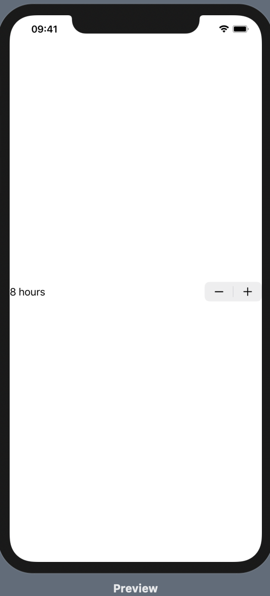
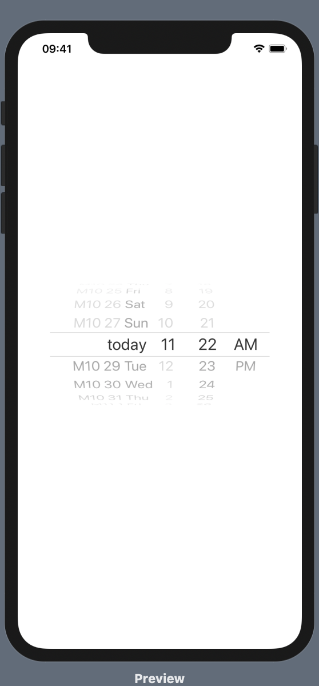
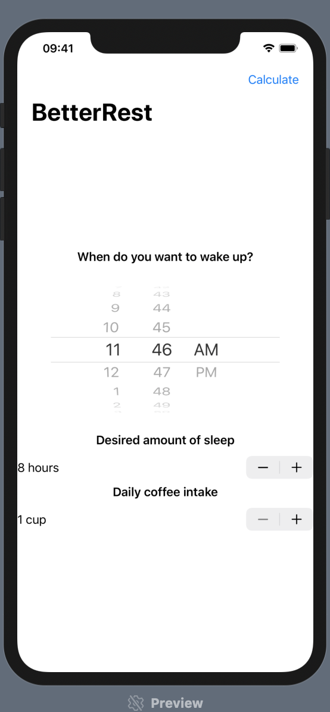

# Better Rest

## Steppers

```swift
struct ContentView: View {
    @State private var sleepAmount = 8.0
    
    var body: some View {
        Stepper(value: $sleepAmount, in: 4...12, step: 0.25) {
            Text("\(sleepAmount, specifier: "%g") hours")
        }
    }
}
```




## DatePicker

```swift
struct ContentView: View {
    @State private var wakeUp = Date()
    
    var body: some View {
        DatePicker("Please enter a date", selection: $wakeUp, in: Date()...)
        .labelsHidden()
    }
}
```



---

## Building a basic layout 

```swift
struct ContentView: View {
    @State private var wakeUp = Date()
    @State private var sleepAmount = 8.0
    @State private var coffeeAmount = 1.0
    
    var body: some View {
        NavigationView{
            VStack {
                Text("When do you want to wake up?")
                    .font(.headline)
                
                DatePicker("Please enter a time", selection: $wakeUp, displayedComponents: .hourAndMinute)
                .labelsHidden()
                
                Text("Desired amount of sleep")
                    .font(.headline)
                
                Stepper(value: $sleepAmount, in: 4...12, step: 0.25) {
                    Text("\(sleepAmount, specifier: "%g") hours")
                }
                
                Text("Daily coffee intake")
                    .font(.headline)
                
                Stepper(value: $coffeeAmount, in: 1...20) {
                    if coffeeAmount == 1 {
                        Text("1 cup")
                    } else {
                        Text("\(coffeeAmount) cups")
                    }
                }
            }
        .navigationBarTitle("BetterRest")
        .navigationBarItems(trailing:
            Button(action: calculateBedtime) {
                Text("Calculate")
            }
            )
        }
    }
    
    func calculateBedtime() {
        
    }
}
```



---

## Connecting SwiftUI to CoreML

