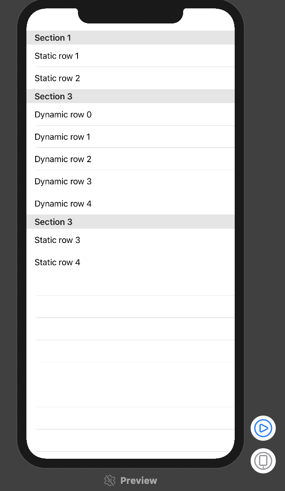
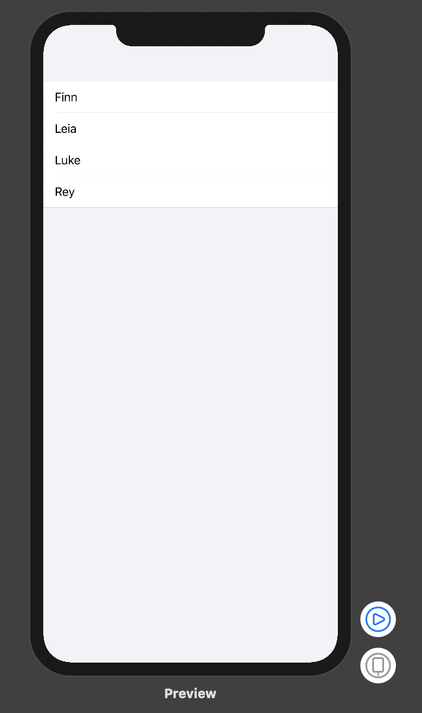
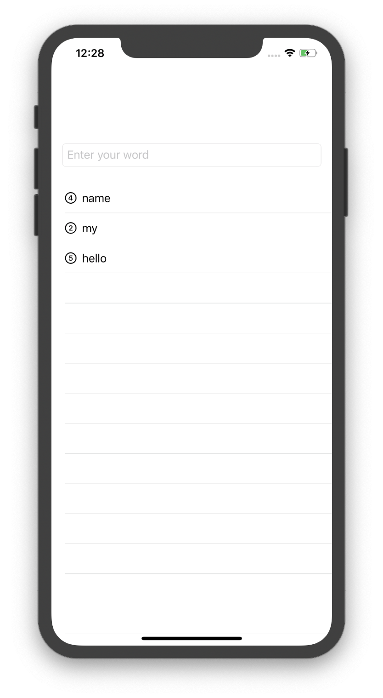
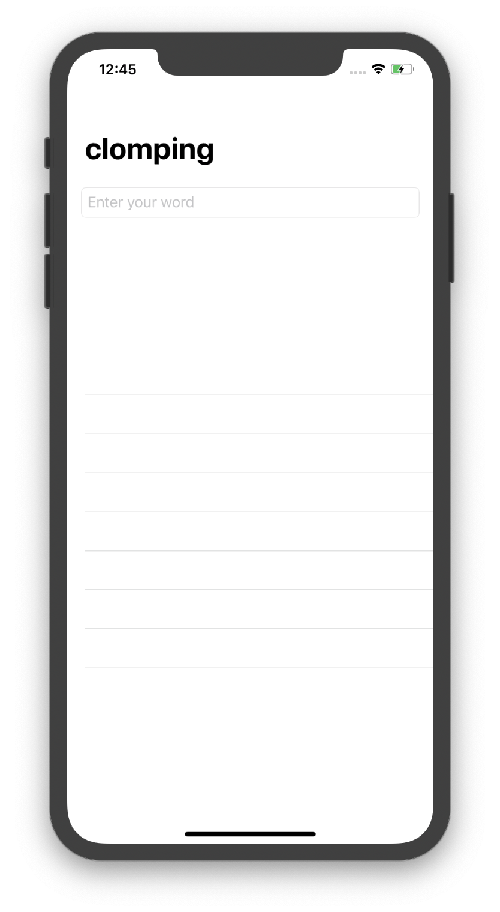
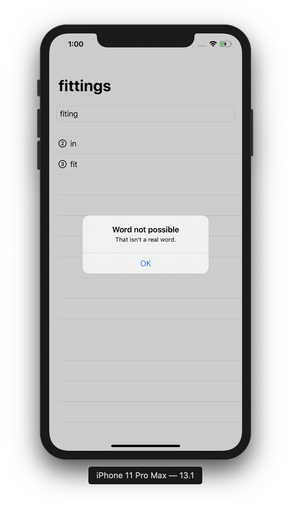
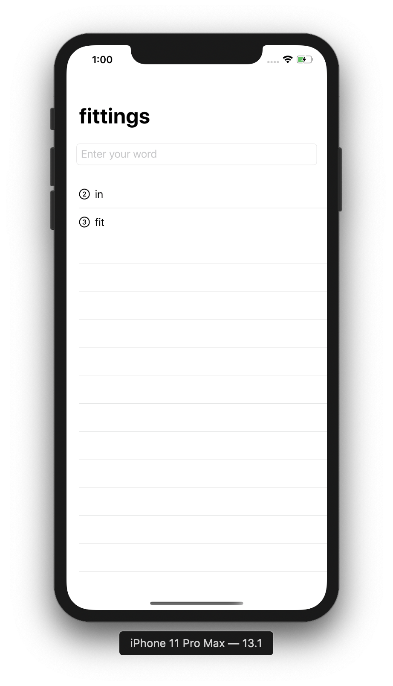
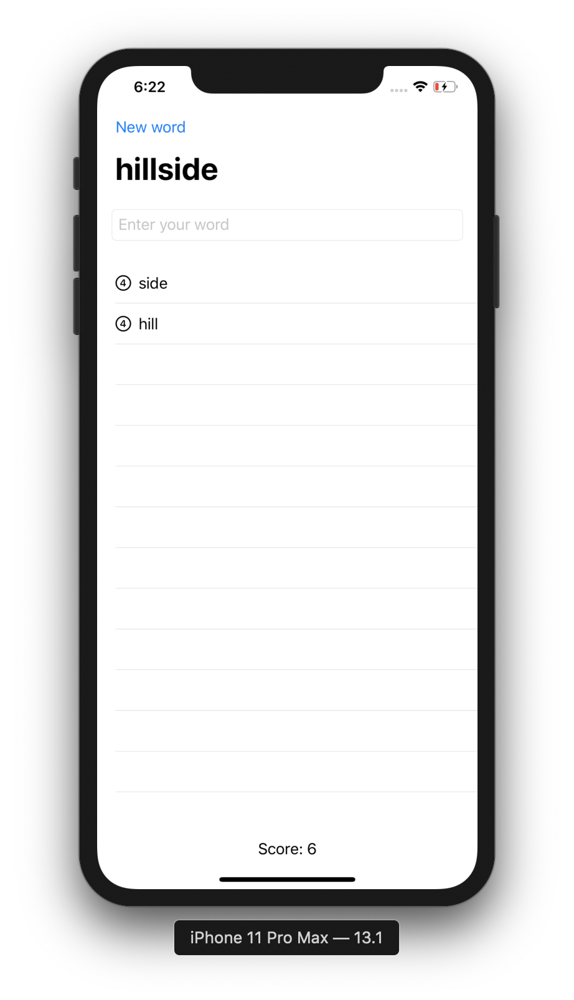

# Word Scramble

## List

List```: working with tables of data, and strings, for handling text. This is the equivalent of ```UITableView```. However, here we can have **static** and **dynamic** rows inside the same ```List``` view. 

```swift
struct ContentView: View {
    var body: some View {
        List {
            Section(header: Text("Section 1")) {
                Text("Static row 1")
                Text("Static row 2")
            }
            Section(header: Text("Section 3")) {
                ForEach(0..<5){
                    Text("Dynamic row \($0)")
                }
            }
            Section(header: Text("Section 3")) {
                Text("Static row 3")
                Text("Static row 4")
            }
        }
    }
}
```


```swift
struct ContentView: View {    
    let people = ["Finn", "Leia", "Luke", "Rey"]   
    var body: some View {
        List(people, id: \.self) {
            Text($0)
        }
        .listStyle(GroupedListStyle())
    }
}
```



```swift
struct ContentView: View {
    let people = ["Finn", "Leia", "Luke", "Rey"]
    var body: some View {
        List {
            ForEach(people, id: \.self) {
                Text($0)
            }
        }
    .listStyle(GroupedListStyle())
    }
}
```



---

## Loading resources from your app bundle

When Xcode builds your app, it creates something called a *bundle*. This happens on all Apple's platforms and it allows the system to store all the files for a single app in one place. 

```swift
struct ContentView: View {
    var body: some View {
        if let fileURL = Bundle.main.url(forResource: "some-file", withExtension: "txt") {
            if let fileContents = try? String(contentsOf: fileURL) {
                //now we can work with the file content
            }
        }
        return Text("hello world")
    }
}
```

## Working with strings

```swift
struct ContentView: View {
    var body: some View {
        
        let input = """
                    a
                    b
                    c
                    """
        let letters = input.components(separatedBy: "\n")
        let letter = letters.randomElement()
        
        let trimmed = letter?.trimmingCharacters(in: .whitespacesAndNewlines)
        
        //checking a string for mispelled words
        let word = "swift"
        let checker = UITextChecker()
        let range = NSRange(location: 0, length: word.utf16.count)
        let mispelledRange = checker.rangeOfMisspelledWord(in: word, range: range, startingAt: 0, wrap: false, language: "en")
        let allGood = mispelledRange.location == NSNotFound
        
        return Text(letter ?? "nothing to show")
    }
}
```

---

## Adding to a list of words

```swift
struct ContentView: View {
    
    @State private var usedWords = [String]()
    @State private var rootWord = ""
    @State private var newWord = ""
    
    var body: some View {
        NavigationView {
            VStack {
                TextField("Enter your word", text: $newWord, onCommit: addNewWord)
                    .textFieldStyle(RoundedBorderTextFieldStyle())
                    .autocapitalization(.none)
                    .padding()
                
                List(usedWords, id: \.self) {
                    Image(systemName: "\($0.count).circle")
                    Text($0)
                }
            }
            .navigationBarTitle(rootWord)
        }
    }
    
    func addNewWord(){
        let answer = newWord.lowercased().trimmingCharacters(in: .whitespacesAndNewlines)
        guard answer.count > 0 else {
            return
        }
        
        //extra validation to come
        
        usedWords.insert(answer, at: 0)
        newWord = ""
    }
}
```



## Running code when our app launches

When Xcode builds an iOS project, it puts your compiled program, your Info.plist file, your asset catalog, and any other assets into a single directory called a *bundle*, then gives that bundle the name YourAppName.app. This “.app” extension is automatically recognized by iOS and Apple’s other platforms, which is why if you double-click something like Notes.app on macOS it knows to launch the program inside the bundle.

When we call ```fatalError```, our app will terminate straight away. 

```swift
struct ContentView: View {
    
    @State private var usedWords = [String]()
    @State private var rootWord = ""
    @State private var newWord = ""
    
    var body: some View {
        NavigationView {
            VStack {
                TextField("Enter your word", text: $newWord, onCommit: addNewWord)
                    .textFieldStyle(RoundedBorderTextFieldStyle())
                    .autocapitalization(.none)
                    .padding()
                
                List(usedWords, id: \.self) {
                    Image(systemName: "\($0.count).circle")
                    Text($0)
                }
            }
            .navigationBarTitle(rootWord)
            .onAppear {
                self.startGame()
            }
        }
    }
    
    func addNewWord(){
        let answer = newWord.lowercased().trimmingCharacters(in: .whitespacesAndNewlines)
        guard answer.count > 0 else {
            return
        }
        
        //extra validation to come
        
        usedWords.insert(answer, at: 0)
        newWord = ""
    }
    
    func startGame() {
        if let startWordsURL = Bundle.main.url(forResource: "start", withExtension: "txt") {
            if let startWords = try? String(contentsOf: startWordsURL) {
                let allWords = startWords.components(separatedBy: "\n")
                rootWord = allWords.randomElement() ?? "silkworm"
                return
            }
        }
        fatalError("Could not load start.txt from bundle.")
    }
}
```



## Validating words with UITextChecker

```swift
struct ContentView: View {
    
    @State private var usedWords = [String]()
    @State private var rootWord = ""
    @State private var newWord = ""
    
    @State private var errorTitle = ""
    @State private var errorMessage = ""
    @State private var showingError = false
    
    var body: some View {
        NavigationView {
            VStack {
                TextField("Enter your word", text: $newWord, onCommit: addNewWord)
                    .textFieldStyle(RoundedBorderTextFieldStyle())
                    .autocapitalization(.none)
                    .padding()
                
                List(usedWords, id: \.self) {
                    Image(systemName: "\($0.count).circle")
                    Text($0)
                }
            }
            .navigationBarTitle(rootWord)
            .onAppear(perform: self.startGame)
            .alert(isPresented: $showingError) {
                Alert(title: Text(errorTitle), message: Text(errorMessage), dismissButton: .default(Text("OK")))
            }
        }
    }
    
    func addNewWord(){
        let answer = newWord.lowercased().trimmingCharacters(in: .whitespacesAndNewlines)
        guard answer.count > 0 else {
            return
        }
        
        guard isOriginal(word: answer) else {
            wordError(title: "Word used already", message: "Be more original.")
            return
        }
        guard isPossible(word: answer) else {
            wordError(title: "Word not recognized", message: "You can't just make them up, you know.")
            return
        }
        guard isReal(word: answer) else {
            wordError(title: "Word not possible", message: "That isn't a real word.")
            return
        }
        
        usedWords.insert(answer, at: 0)
        newWord = ""
    }
    
    func startGame() {
        if let startWordsURL = Bundle.main.url(forResource: "start", withExtension: "txt") {
            if let startWords = try? String(contentsOf: startWordsURL) {
                let allWords = startWords.components(separatedBy: "\n")
                rootWord = allWords.randomElement() ?? "silkworm"
                return
            }
        }
        fatalError("Could not load start.txt from bundle.")
    }
    
    func isOriginal(word: String) -> Bool {
        !usedWords.contains(word)
    }
    
    func isPossible(word: String) -> Bool {
        var tmpWord = rootWord.lowercased()
        for letter in word {
            if let pos = tmpWord.firstIndex(of: letter) {
                tmpWord.remove(at: pos)
            }else {
                return false
            }
        }
        return true
    }
    
    func isReal(word: String) -> Bool {
        let checker = UITextChecker()
        let range = NSRange(location: 0, length: word.utf16.count)
        let mispelledRange = checker.rangeOfMisspelledWord(in: word, range: range, startingAt: 0, wrap: false, language: "en")
        return mispelledRange.location == NSNotFound
    }
    
    func wordError(title: String, message: String) {
        errorTitle = title
        errorMessage = message
        showingError = true
    }
}
```






---

