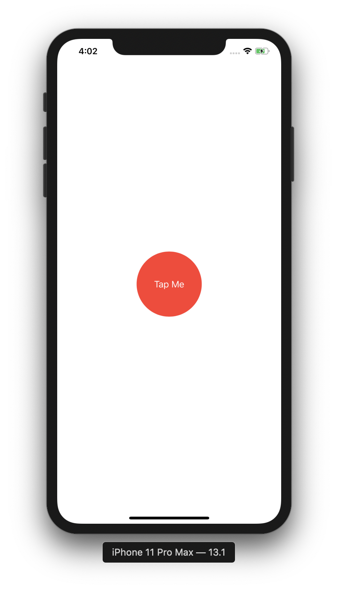
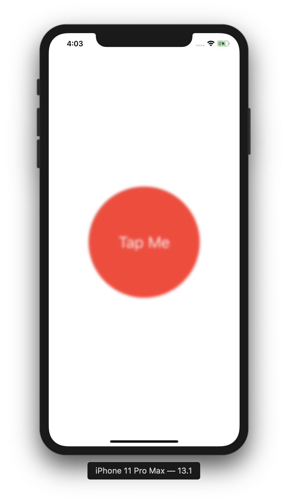
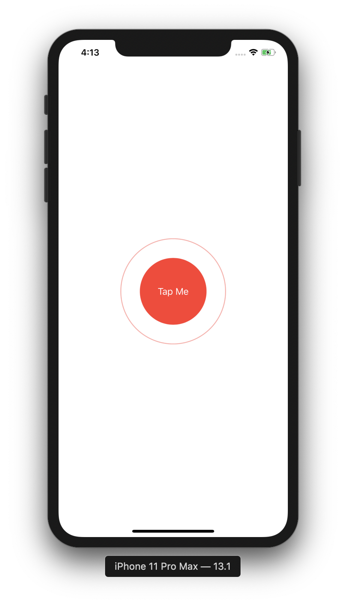
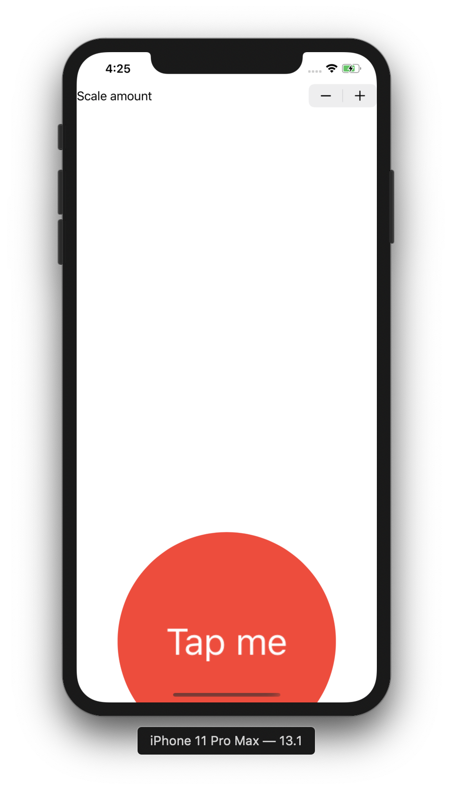
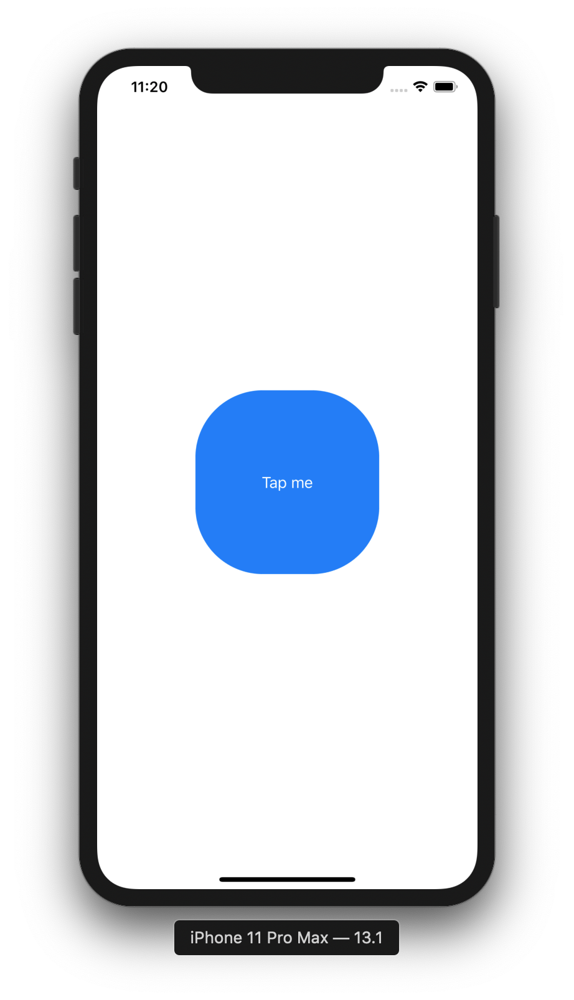
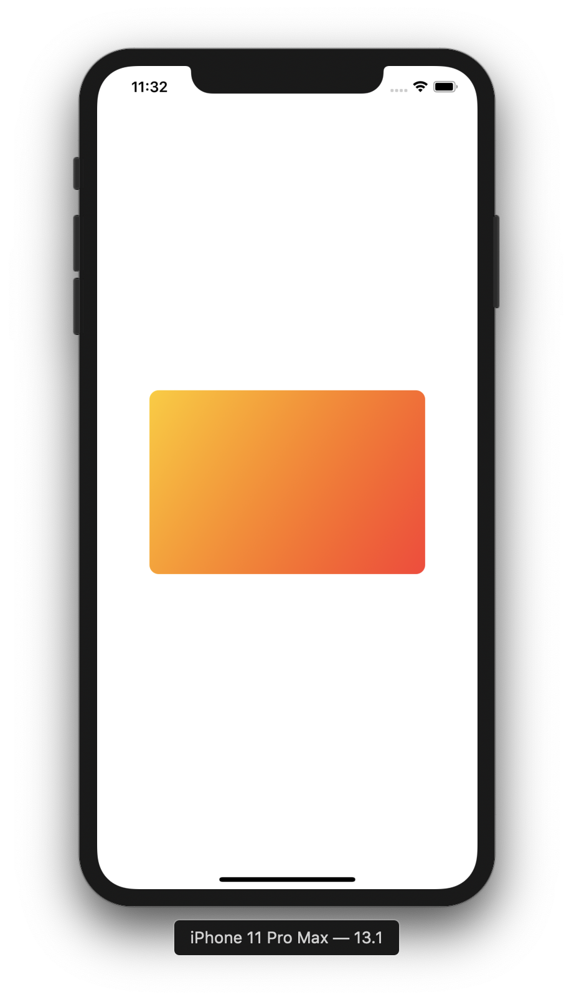
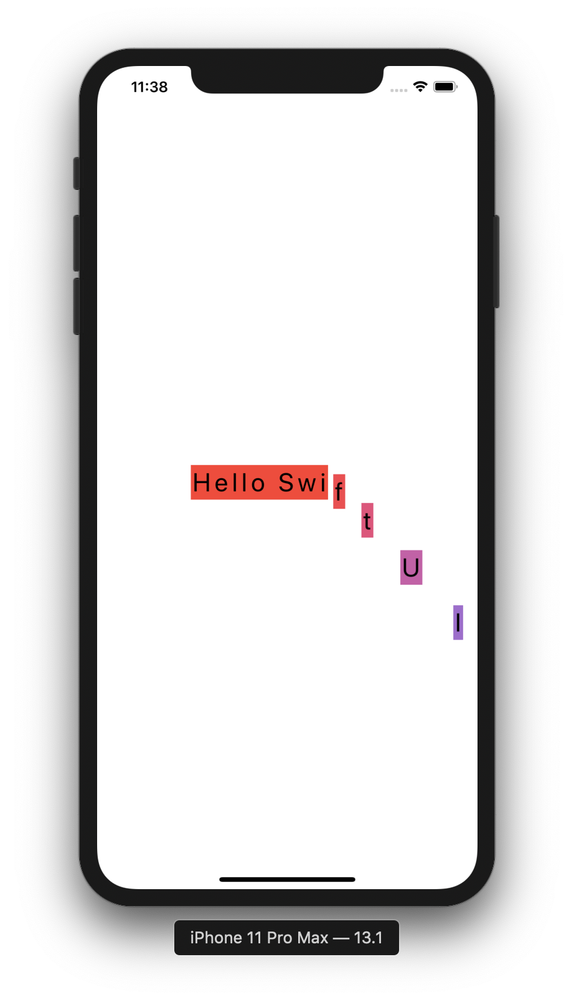
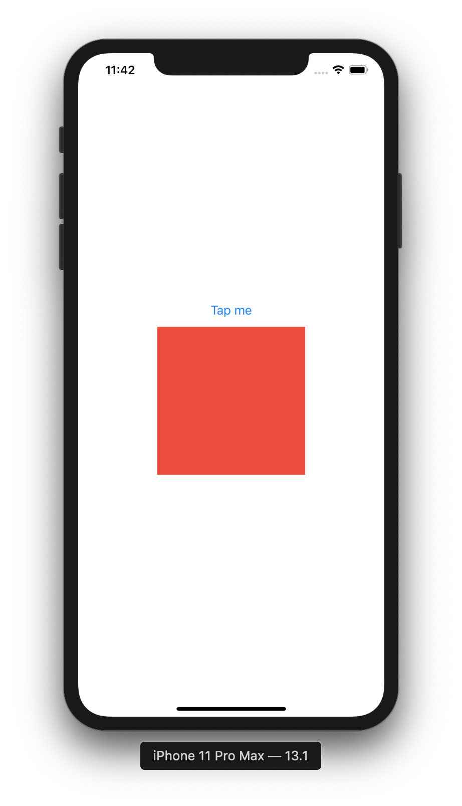
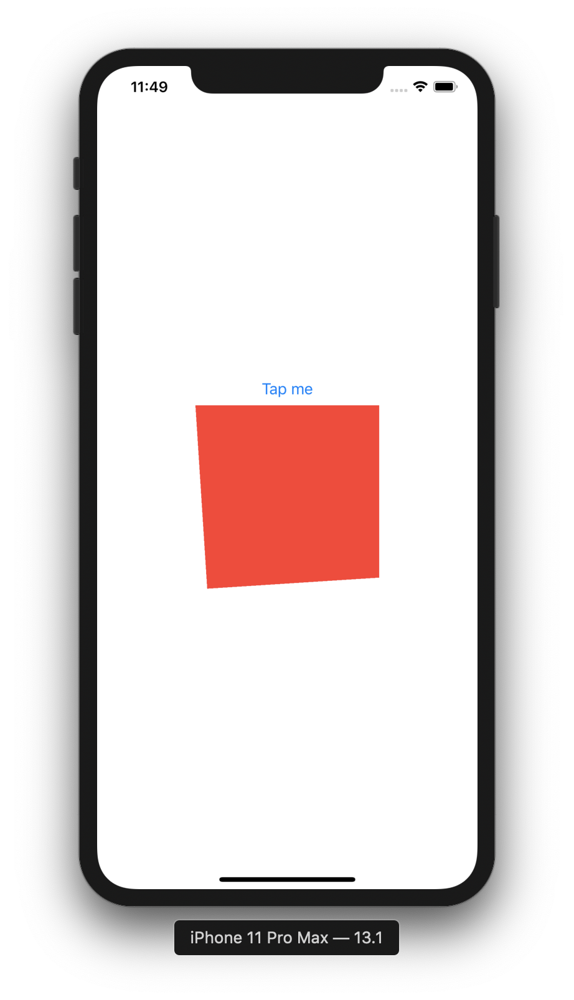

# Animations

## Creating implicit animations 

```swift
struct ContentView: View {
    
    @State private var animationAmount: CGFloat = 1
    
    var body: some View {
        Button("Tap Me") {
            self.animationAmount += 1
        }
        .padding(50)
        .background(Color.red)
        .foregroundColor(.white)
        .clipShape(Circle())
        .scaleEffect(animationAmount)
        .blur(radius: (animationAmount - 1) * 3)
        .animation(.default)
    }
}
```





---

## Customizing animations in SwiftUI

```swift
struct ContentView: View {
    
    @State private var animationAmount: CGFloat = 1
    
    var body: some View {
        Button("Tap Me") {
            
        }
        .padding(50)
        .background(Color.red)
        .foregroundColor(.white)
        .clipShape(Circle())
        .overlay (
            Circle()
                .stroke(Color.red)
                .scaleEffect(animationAmount)
                .opacity(Double(2 - animationAmount))
                .animation (
                    Animation
                        .easeInOut(duration: 2)
                        .repeatForever(autoreverses: false)
                )
        )
        .onAppear {
            self.animationAmount = 2
        }
        
    }
}
```



---

## Animation bindings

```swift
struct ContentView: View {
    
    @State private var animationAmount: CGFloat = 1
    
    var body: some View {
        print(animationAmount)
        return VStack {
            Stepper("Scale amount", value: $animationAmount.animation(
                Animation
                .easeInOut(duration: 1)
                .repeatCount(3, autoreverses: true)
            ), in: 1...10)
            Spacer()
            Button("Tap me") {
                self.animationAmount += 1
            }
            .padding(40)
            .background(Color.red)
            .foregroundColor(.white)
            .clipShape(Circle())
            .scaleEffect(animationAmount)
        }
    }
}
```



---

## Creating explicit animations

```swift
struct ContentView: View {
    
    @State private var animationAmount = 0.0
    
    var body: some View {
        Button("Tap me") {
            withAnimation(.interpolatingSpring(stiffness: 5, damping: 1)) {
                self.animationAmount += 360
            }
        }
        .padding(50)
        .background(Color.red)
        .foregroundColor(.white)
        .clipShape(Circle())
        .rotation3DEffect(.degrees(animationAmount), axis: (x: 0, y:1, z:0))
    }
}
```

---

## Controlling the animation stack

Animations animates all the modifiers that comes before up until the last animation. 

```swift
struct ContentView: View {
    
    @State private var enabled = false
    
    var body: some View {
        Button("Tap me") {
            self.enabled.toggle()
        }
        .frame(width: 200, height: 200)
        .foregroundColor(.white)
        .background(enabled ? Color.blue : Color.red)
        .animation(.default)
        .clipShape(RoundedRectangle(cornerRadius: enabled ? 60 : 0))
        .animation(.interpolatingSpring(stiffness: 10, damping: 1))
    }
}
```



---

## Animating gestures

```swift
struct ContentView: View {
    @State private var dragAmount = CGSize.zero
    
    var body: some View {
        LinearGradient(gradient: Gradient(colors: [.yellow, .red]), startPoint: .topLeading, endPoint: .bottomTrailing)
            .frame(width: 300, height: 200)
            .clipShape(RoundedRectangle(cornerRadius: 10))
            .offset(dragAmount)
        .gesture(
            DragGesture()
                .onChanged {self.dragAmount = $0.translation }
                .onEnded {_ in
                    withAnimation(.spring()) {
                        self.dragAmount = .zero
                    }
                }
        )
    }
}
```



```swift
struct ContentView: View {
    let letters = Array("Hello SwiftUI")
    @State private var enabled = false
    @State private var dragAmount = CGSize.zero
    
    var body: some View {
        HStack(spacing: 0) {
            ForEach(0..<letters.count) { num in
                Text(String(self.letters[num]))
                    .padding(2)
                    .font(.title)
                    .background(self.enabled ? Color.blue : Color.red)
                    .offset(self.dragAmount)
                    .animation(Animation.default.delay(Double(num) / 20))
            }
        }
        .gesture (
            DragGesture()
                .onChanged{ self.dragAmount = $0.translation }
                .onEnded {_ in
                    self.dragAmount = .zero
                    self.enabled.toggle()
                }
        )
    }
}
```



---

## Showing and hiding animations with transitions

```swift
struct ContentView: View {
    @State private var isShowingRed = false
    
    var body: some View {
        VStack {
            Button("Tap me") {
                withAnimation {
                    self.isShowingRed.toggle()
                }
            }
            if isShowingRed {
                Rectangle()
                    .fill(Color.red)
                    .frame(width: 200, height: 200)
                    .transition(.asymmetric(insertion: .scale, removal: .opacity))
            }
        }
    }
}
```



---

## Building custom transitions using ViewModifier

```swift
struct CornerRotateModifier: ViewModifier {
    let amount: Double
    let anchor: UnitPoint
    
    func body(content: Content) -> some View {
        content.rotationEffect(.degrees(amount), anchor: anchor)
            .clipped()
    }
}

extension AnyTransition {
    static var pivot: AnyTransition {
        .modifier (
            active: CornerRotateModifier(amount: -90, anchor: .topLeading), identity: CornerRotateModifier(amount: 0, anchor: .topLeading)
        )
    }
}

struct ContentView: View {
    @State private var isShowingRed = false
    
    var body: some View {
        VStack {
            Button("Tap me") {
                withAnimation {
                    self.isShowingRed.toggle()
                }
            }
            if isShowingRed {
                Rectangle()
                    .fill(Color.red)
                    .frame(width: 200, height: 200)
                    .transition(.pivot)
            }
        }
    }
}
```



