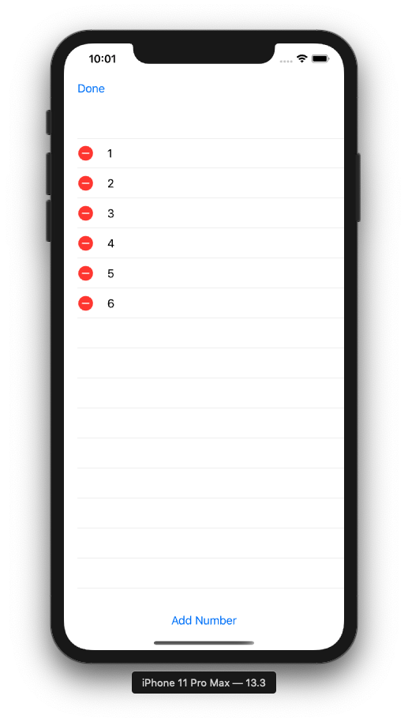

# iExpense

Linus Torvalds once said: 

> Nobody should start to undertake a large project. You start with a small trivial project, and you should never expect it to get large. If you do, you'll just overdesign and generally think it is more important that it likely is at that stage. Or worse, you might be scared away by the sheer size of the work you envision.

## Why @State works only with structs

SwiftUI's @State property wrapper is designed for simple data that is local to the current view, but its stop being useful as soon as you want to share data between views. Therefore, we need to use classes because if we have two SwiftUI views and we send them the same struct, they will actualli have a unique copy of that struct; if one changes, the other won't see that change and by using classes they will share changes. 


When we use @State in a property and if that propertiy's value changes, SwiftUI will re-invoke the body property of the view. When a class changes @State doesn't notice anything and can't reload the view. 

## @ObservedObject

1. Make class conform to **ObservableObject** protocol
2. Use @Published property wrapper for properties that we want to be shared
3. Use @ObservedObject on the instance of the class


## Showing and hiding views

One of the most basic ways of shoiwng views -> **sheet**

We define the conditions under which a sheet should be shown


**Dismiss views programatically**


@Environment property wrappers allows us to create properties that store values provided to us externally 

## Deleting items using onDelete()

SwiftUI gives us the onDelete() modifier to control how obkects should be deleted from a collection.  It only exists on ForEach. 




## Storing user settings with UserDefaults

UserDefaults: allows to store small amounts of data because everything you store  will be loaded each time you open the app(no more than 512 KB). UD is stringly typed which means some code that uses string in places where they might cause problems. 

1. UserDefaults.standard: built in instance of UserDefaults thtat is attached to our app. 
2. set(): 
3. Key: if it can't be fount, it will return 0 if you are searching for an integer. 


## Archiving Swift objects with Codable

UserDefaults is great for storing simple settings like Integers or Floats, but not to store complex data. Swift gives us a protocol called **Codable** for archiving and unarchiving data. 


---

## Building a list we can delete from

We need to use a ForEach inside a List to get access to onDelete() modifier. 


## Working with Identifiable items in SwiftUI

When we use List or ForEach to make dynamic views, SwiftUI needs to know how it can identify each item uniquely otherwise it's not able to compare view hierarchies to figure out what has changed. We need to add a UUID (universally unique identifier) to each instance of our struct. By using Identifiable as a protocol on our struct, we need to provide an ```id``` property. 


And now, we can do the following with the ForEach loop:


## Sharing an observed object with a new view

Classes that conform to the ObservableObject protocol can be used in more than one SwiftUI view.


## Making changes permanent with UserDefaults


