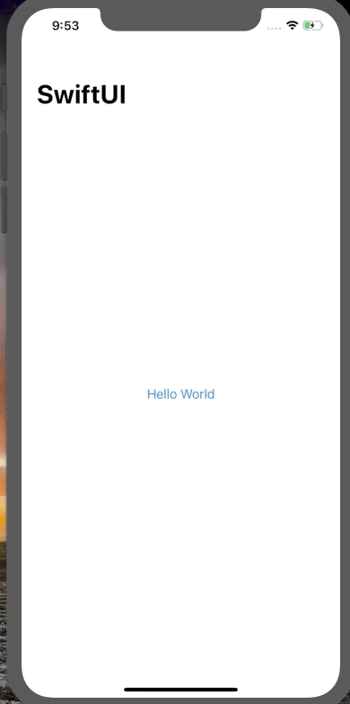

# Moonshot

Neil Armstrong once said: 

> Science is about what is; engineering is about what can be

#### Objectives:

- GeometryReader
- ScrollView
- NavigationLink

---

## Resizing images to fit the screen using GeometryReader

When we create an Image view in SwiftUI, it will automatically size itself according to the dimensions of its contents. We are going to use GeometryReader to make sure our image fills the full width of its container view. GeometryReader is a view, but when we create one we will have eto work with a GeometryProxy object which lets us query the environment. 


## How ScrollView lets us work with scrolling data

ScrollView is useful when we want to scroll arbitrary data and it can scroll horizontally, vertically or in both directions. When we place views inside scroll views, they automatically figure out the size of that content so that users can scroll from one edge to the other. 


When we add views to the ScrollView they get created immediately. If we use a custom view for creating a Text with:

- ForEach: all the views will be created immediately.
- List: the views will be created as needed, because a List works similar to a table view and only loads into memory the needed views. 


## Pushing new views onto the stack using NavigationLink

SwiftUI's NavigationView also lets us push a view onto a view stack. Using a NavigationLink we can do that: give it a destination and something that can be tapped. We can use them with any kind of destination view. We can show extra views with either Sheet or NavigationLinks. However, we use NavigationLinks to show details of the current screen and Sheets when we want to present unrelated information. 





Another example...


## Working with hierarchical Codable data


---

## Loading a specific kind of Codable data


```swift
let astronauts = Bundle.main.decode("astronauts.json")
```

## Using generics to load any kind of Codable data


The only difference is that we have to specify the type we are using...

```swift
let astronauts: [Astronaut] = Bundle.main.decode("astronauts.json")
let missions: [Mission] = Bundle.main.decode("missions.json")
```


## Formatting our mission view


---

## Showing mission details with ScrollView and GeometryReader


## Merging Codable structs using first(where:) 


```swift
NavigationLink(destination: MissionView(mission: mission, astronauts: self.astronauts))
```


