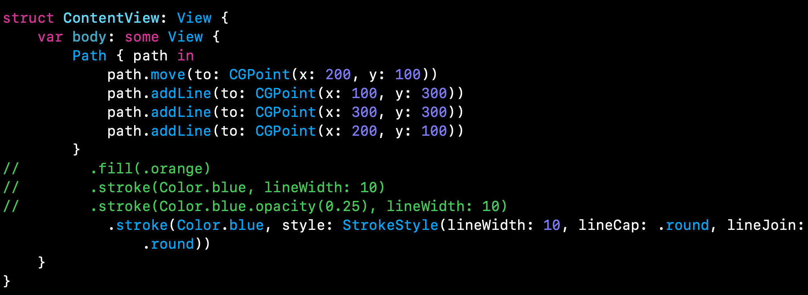
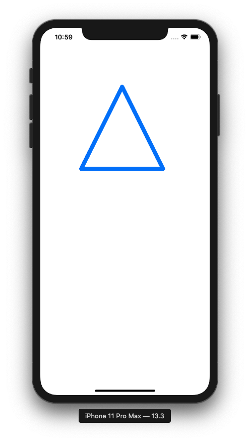
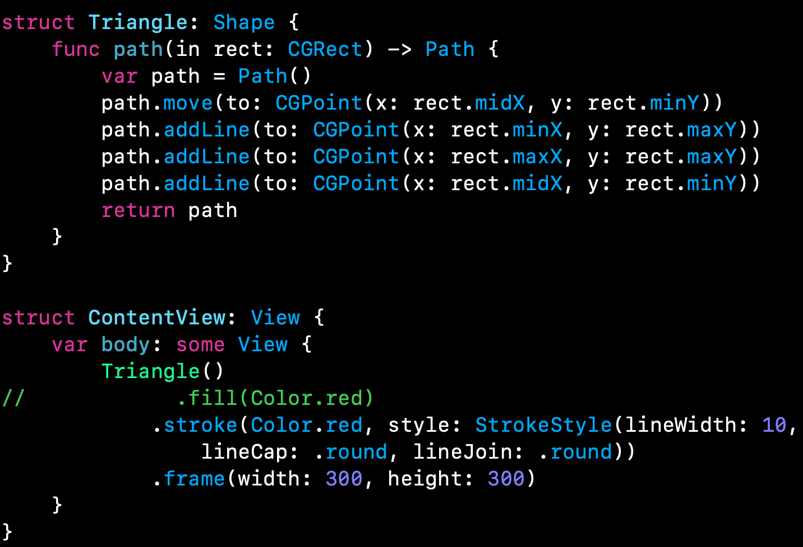
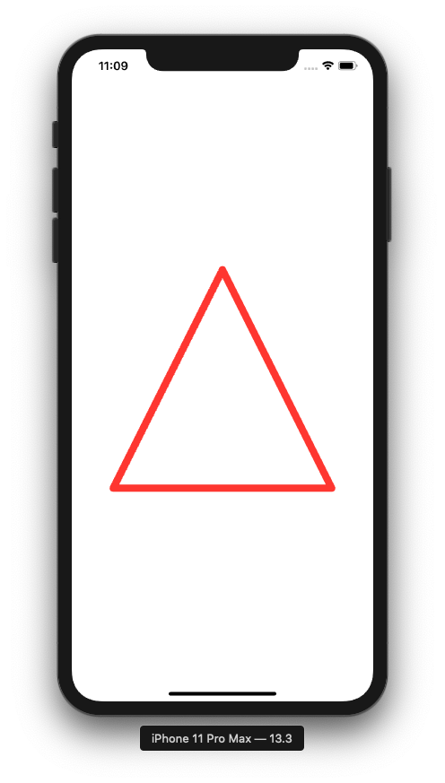
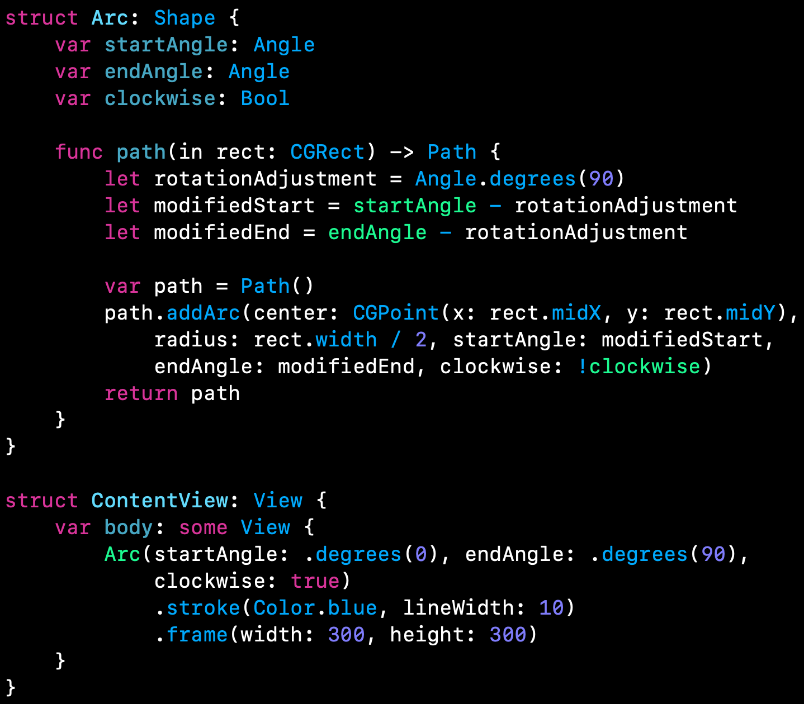
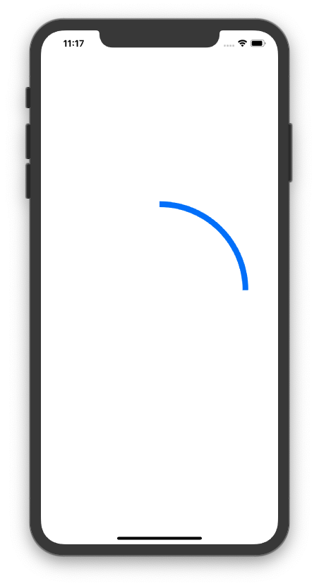
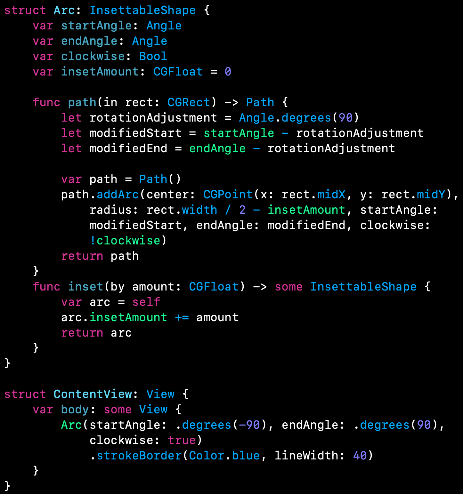
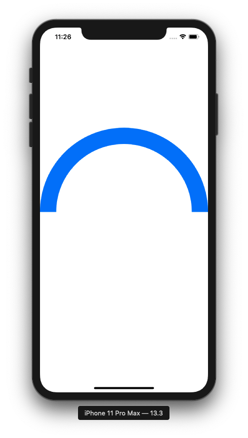

# Drawing: second technique project

Dutch impressionist Vincent Van Gogh once said:

> I sometimes think there is nothing so delightful as drawing

## Introduction

In this project we are going to focus on drawing in SwiftUI, including creating custom paths and shapes, animating your changes, solving performance problems. SwiftUI uses the same drawing system that we have on the rest of Apple's frameworks: Core Animation and Metal. CoreAnimation is responsible for our drawing or UI elements such as TextField and when things get too complex we look for Metal - Apple's low level  framework that's optimized for drawing.

## Creating custom paths with SwiftUI

SwiftUI gives a dedicated Path type to draw custom shapes. Pahts are views in their own right which means we can use them as text views or images. 

## Paths vs shapes in SwiftUI

SwiftUI enables custom drawing with:

- Path: series of drawing instructions all using absolute coordinates. 
- Shape: has no idea of where it will be used or how big it will be used, but instead will be asked to draw itself inside a given rectangle therefore we don't need to use absoulte coordinates. *Shapes are built using Paths.*

Paths are designed to do one specific thing, whereas shapes have the flexibility of drawing space and can also accept parameters to let us customize them further. 

## Adding strokeBorder() support with InsettableShape

