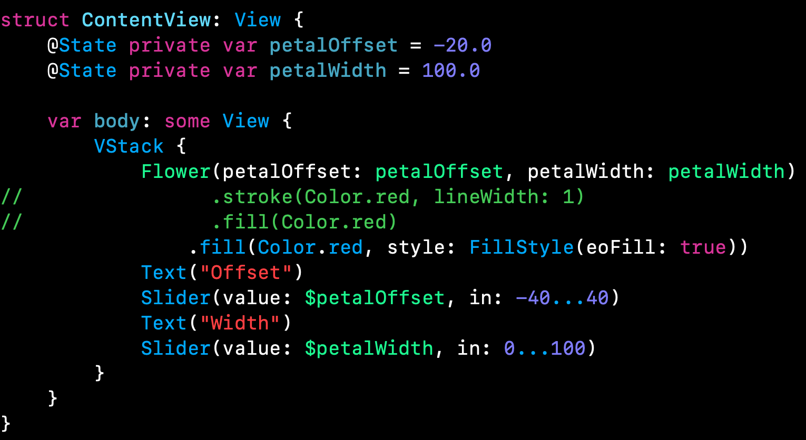
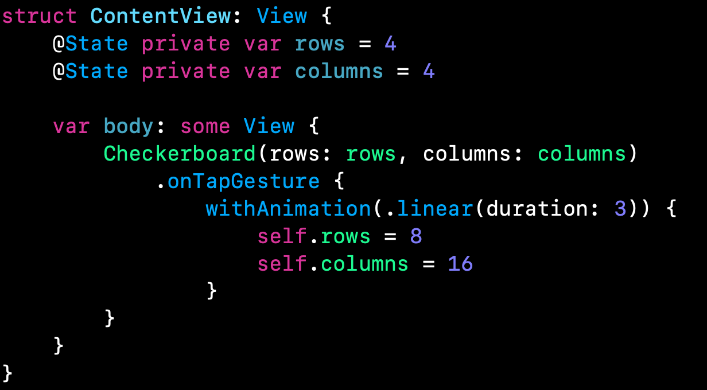

# Drawing: second technique project

Dutch impressionist Vincent Van Gogh once said:

> I sometimes think there is nothing so delightful as drawing

## Introduction

In this project we are going to focus on drawing in SwiftUI, including creating custom paths and shapes, animating your changes, solving performance problems. SwiftUI uses the same drawing system that we have on the rest of Apple's frameworks: Core Animation and Metal. CoreAnimation is responsible for our drawing or UI elements such as TextField and when things get too complex we look for Metal - Apple's low level  framework that's optimized for drawing.

## Creating custom paths with SwiftUI

SwiftUI gives a dedicated Path type to draw custom shapes. Pahts are views in their own right which means we can use them as text views or images. 

## Paths vs shapes in SwiftUI

SwiftUI enables custom drawing with:

- Path: series of drawing instructions all using absolute coordinates. 
- Shape: has no idea of where it will be used or how big it will be used, but instead will be asked to draw itself inside a given rectangle therefore we don't need to use absoulte coordinates. *Shapes are built using Paths.*

Paths are designed to do one specific thing, whereas shapes have the flexibility of drawing space and can also accept parameters to let us customize them further. 

## Adding strokeBorder() support with InsettableShape

---

## Transforming shapes using CGAffineTransform and even-odd fills

**CGAffineTransform**: how path or view should be rotated, scaled or sheared. 

**Even-odd fills**: allows us to control how overlapping shapes should be rendered. 

Now, using even-odd fills...

## Creative borders and fills using ImagePaint

SwiftUI gives us a dedicated type that wraps images in a way that we have complete control over how they should be rendered, which in turn means we can use them for borders and fills without any problem. This type is called **ImagePaint**. 

Using the second parameter: sourceRect...

**ImagePaint** can also be used for view backgrounds and aslo shape strokes...

## Enabling high-performance Metal rendering with drawingGroup()

SwiftUI uses Core Animation for its rendering by default, which offers great performance out of the box. However, for complex rendering you might find your code starts to slow down - anything below 60 FPS is a problem, but really you ought to aim higher because many iOS devices now render at 120 FPS. 

However, if we do the following change, SwiftUI struggles to render 100 gradients as part of 100 separate views. 

We can fix this by applying the **drawingGroup()** modifier which tells SwiftUI to render the contents of its view into an off-screen image before putting it back onto the screen as a signle rendered output, which is significantly faster. Behind the scenes, this is powerded by **Metal** which is Apple's framework for working directly with the GPU for extremely fast graphics. However, we should wait until we have a performance problem to use **drawingGroup()** since adding the off-screen render pass might slow down SwiftUI for simple drawing. 

---

## Special effects in SwiftUI: blurs, bending and more

Blend modes allows us to control the way one view is rendered on top of another.

## Animating simples shapes with animatableData

SwiftUI examines the state of our view before the binding changes, and examines it again after the binding changes, then applying an animation to get from point A to point B. When we use **withAnimation()**, SwiftUI immediately changes our state property to its new value, but behind the scene's, it's also keeping track of the changing value over time as part of the animation. As the animation progresses, SwiftUI will set the **animatableData** property or our shape to the latest value. 

## Animating complex shapes with AnimatablePair

SwiftUI uses **animatableData** property to let us animate changes to shapes, however, it only works with one property. If we were to work with more properties we need to use **AnimatablePair**. 

**AnimatablePair** contains a pair of animatable values. 

## Creating a spirograph with SwiftUI

---

## Wrapup: Arrow and ColorCyclingRectangle

